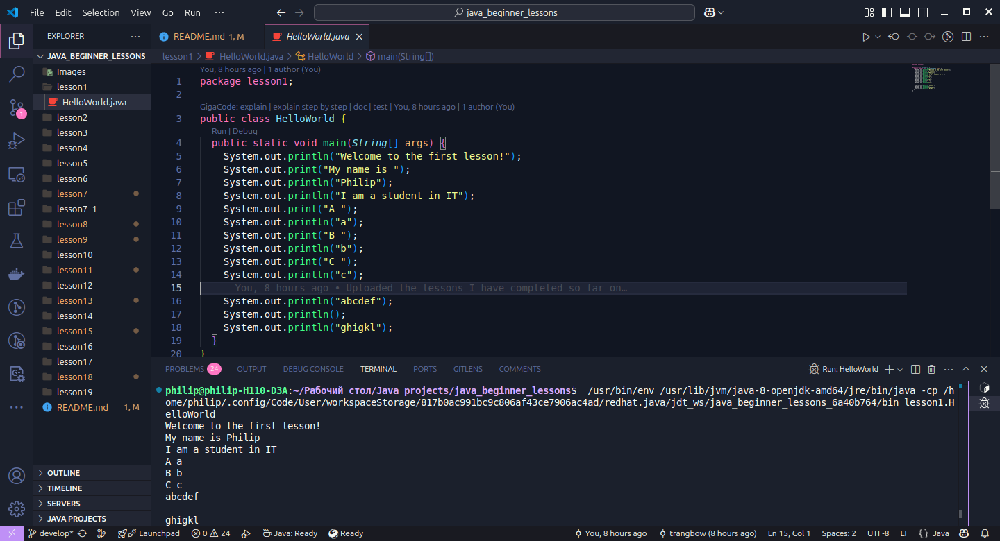
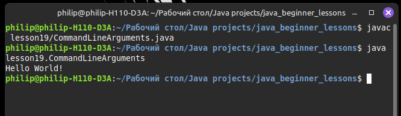

# Java Beginner Lessons

## Урок 1: Вывод в консоль

В этом уроке мы изучаем два основных метода вывода в консоль:

- **`System.out.println()`** — вывод с переводом строки.
- **`System.out.print()`** — вывод без перевода строки.

Код урока находится в файле: [HelloWorld.java](./lesson1/HelloWorld.java).


*Рис. 1.1 – Пример вывода*

---

## Урок 2: Примитивные типы данных и литералы

В этом уроке рассматриваются:

- Примитивные типы данных:
  - Целочисленные: `byte`, `short`, `int`, `long`
  - С плавающей точкой: `float`, `double`
  - Символьный: `char`
  - Логический: `boolean`
- Представление чисел в двоичном, восьмеричном и шестнадцатиричном форматах.
- Использование литерала с подчеркиванием (начиная с Java 7).

Код урока доступен в файле: [PrimitiveDataTypes.java](./lesson2/PrimitiveDataTypes.java).

---

## Урок 3: Арифметические, логические, операции присваивания и сравнения

В этом уроке рассматриваются основные типы операций в Java:

1. **Арифметические:** `+`, `-`, `*`, `/`, `%`
2. **Операции сравнения:** `==`, `!=`, `>`, `<`, `>=`, `<=`
3. **Логические операции:** `&&`, `||`, `!`
4. **Операции присваивания:** `=`, `+=`, `-=`, `*=`, `/=`

Код урока доступен в файле: [ArithmeticAndLogicaAndAssignmentAndRelationalOperations.java](./lesson3/ArithmeticAndLogicaAndAssignmentAndRelationalOperations.java).

---

## Урок 4: Основы ООП — Классы, объекты и ссылочные типы

### Основные концепции

- **Класс** — шаблон/чертеж для создания объектов.
- **Объект** — экземпляр класса в памяти.
- **Ссылочный тип** — тип данных, хранящий ссылку на объект.

### Отличия от примитивных типов

| Характеристика      | Примитивные типы       | Ссылочные типы         |
|---------------------|------------------------|------------------------|
| Хранение            | Значение напрямую      | Ссылка на объект       |
| Размер              | Фиксированный          | Зависит от объекта     |
| Инициализация       | Обязательна            | По умолчанию `null`    |
| Примеры             | `int`, `boolean` и т.д. | `String`, массивы, классы |

### Пример классов

```java
public class Car {
    // Поля класса
    String color = "red";
    String engine = "v6";
}
```

```java
public class BankAccount {
    // Поля класса
    int id;
    String name;
    double balance;
}
```

Код урока доступен в файлах: [Car.java](./lesson4/Car.java), [BankAccount.java](./lesson4/BankAccount.java).

---

## Урок 5: Создание объектов, конструкторы и вызов методов

В этом уроке рассматриваются:

- Процесс создания объектов.
- Концепция конструктора.
- Объявление и вызов методов.

Код урока доступен в файлах: [Car.java](./lesson5/Car.java), [Car2.java](./lesson5/Car2.java), [ConceptAndMethodCall.java](./lesson5/ConceptAndMethodCall.java), [Human.java](./lesson5/Human.java).

---

## Урок 6: Перегрузка методов и конструкторов (`overloading`). Ключевое слово `this`

В этом уроке рассматриваются:

- Перегрузка (`overloading`) методов и конструкторов.
- Использование ключевого слова `this`.

### Перегрузка методов

Перегрузка позволяет объявлять несколько методов с одинаковым именем, но разными параметрами.  

Пример:

```java
public class MathUtils {
    // Метод с одним параметром
    int sum(int a) {
        return a;
    }
    
    // Перегруженный метод с двумя параметрами
    int sum(int a, int b) {
        return a + b;
    }
}
```

### Перегрузка конструкторов

Перегрузка конструкторов позволяет создавать объекты разными способами.

Пример:

```java
public class Car {
    String model;
    int year;

    // Конструктор без параметров
    public Car() {
        this("Unknown", 2000);
    }

    // Конструктор с параметрами
    public Car(String model, int year) {
        this.model = model;
        this.year = year;
    }
}
```

Код урока доступен в файлах: [MethodOverloading.java](./lesson6/MethodOverloading.java), [MethodOverloading2.java](./lesson6/MethodOverloading2.java), [EmployeeConstructorOverloading.java](./lesson6/EmployeeConstructorOverloading.java).

---

## Урок 7: Понятие `package`. Модификаторы видимости (Access Modifiers)

В этом уроке рассматриваются:

- Понятие `package` и его использование.  
- Модификаторы доступа (`private`, `default`, `protected`, `public`).  

### Пакеты (`package`)

Пакеты используются для организации классов и предотвращения конфликтов имен.  
Пример объявления пакета:  

```java
package lesson7;

public class Example {
    public void showMessage() {
        System.out.println("Hello from package lesson7!");
    }
}
```

Использование класса из другого пакета:

```java
import lesson7.Example;

public class Main {
    public static void main(String[] args) {
        Example ex = new Example();
        ex.showMessage();
    }
}
```

### Модификаторы доступа

Определяют область видимости классов, полей и методов.

| Модификатор      | Видимость внутри класса      | Видимость внутри пакета      | Видимость в подклассах      | Видимость в других пакетах      |
|---------------------|------------------------|------------------------|------------------------|------------------------|
| private      | ✅      | ❌      | ❌      | ❌      |
| (default)      | ✅      | ✅      | ❌      | ❌      |
| protected      | ✅      | ✅      | ✅      | ❌      |
| public      | ✅      | ✅      | ✅      | ✅      |

Пример модификаторов доступа

```java
package lesson7;

public class AccessExample {
    private int privateVar = 1;
    int defaultVar = 2;
    protected int protectedVar = 3;
    public int publicVar = 4;
}
```

Использование в другом классе в том же пакете:

```java
package lesson7;

public class TestAccess {
    public static void main(String[] args) {
        AccessExample example = new AccessExample();
        // example.privateVar; // Ошибка: private-поле недоступно
        System.out.println(example.defaultVar);  // Доступно
        System.out.println(example.protectedVar); // Доступно
        System.out.println(example.publicVar);    // Доступно
    }
}
```

Код урока доступен в файлах: [A.java](./lesson7/A.java), [B.java](./lesson7/B.java), [Employee.java](./lesson7/Employee.java), [OtherClass.java](./lesson7/OtherClass.java), [ThirdClass.java](./lesson7_1/ThirdClass.java).

---

## Урок 8: Понятие `константа`. Модификаторы «final» и «static»

В этом уроке рассматриваются:

- Понятие `константа` и его использование.  
- Модификаторы (`final`, `static`).

---

### `final` — неизменяемость

Модификатор `final` делает переменные, методы и классы неизменяемыми.

#### 1. `final` для переменных

Переменная с `final` может быть присвоена только один раз.

```java
public class FinalExample {
    final int CONSTANT = 10;

    void changeValue() {
        // CONSTANT = 20; // Ошибка: нельзя изменить final-переменную
    }
}
```

#### 2. `final` для методов

Методы с `final` нельзя переопределить в наследуемых классах.

```java
class Parent {
    final void show() {
        System.out.println("This is a final method.");
    }
}

class Child extends Parent {
    // void show() { } // Ошибка: нельзя переопределить final-метод
}
```

#### 3. `final` для классов

Класс с `final` нельзя унаследовать.

```java
final class UnmodifiableClass {
}

// class SubClass extends UnmodifiableClass {} // Ошибка: нельзя наследовать final-класс
```

### `static` — принадлежность классу

Модификатор `static` делает переменные и методы принадлежащими классу, а не объектам.

#### 1. `static` переменные

Общие для всех экземпляров класса.

```java
class Counter {
    static int count = 0;

    Counter() {
        count++;
    }
}

public class Main {
    public static void main(String[] args) {
        Counter c1 = new Counter();
        Counter c2 = new Counter();
        System.out.println(Counter.count); // Выведет: 2
    }
}
```

#### 2. `static` методы

Могут вызываться без создания объекта.

```java
class StaticMethodExample {
    static void greet() {
        System.out.println("Hello, world!");
    }
}

public class Main {
    public static void main(String[] args) {
        StaticMethodExample.greet(); // Вывод: Hello, world!
    }
}
```

#### 3. `static` блок

Выполняется один раз при загрузке класса.

```java
class StaticBlockExample {
    static {
        System.out.println("Static block executed.");
    }
}

public class Main {
    public static void main(String[] args) {
        new StaticBlockExample();
        new StaticBlockExample();
    }
}
// Выведет "Static block executed." только один раз
```

### Константы (`static final`)

Переменные, которые нельзя изменить и которые принадлежат классу.

```java
class MathConstants {
    static final double PI = 3.1415926535;
}

public class Main {
    public static void main(String[] args) {
        System.out.println(MathConstants.PI); // Вывод: 3.1415926535
    }
}
```

Код урока доступен в файлах: [Car.java](./lesson8/Car.java), [Student.java](./lesson8/Student.java), [NonAccessModify.java](./lesson8/NonAccessModify.java), [StudentNonAccessStatic.java](./lesson8/StudentNonAccessStatic.java).

---

## Урок 9: Разновидности переменных и пределы их видимости

В этом уроке рассматриваются:

- Виды переменных в Java.  
- Их область видимости и срок жизни.  
- Отличия между локальными, экземплярными и статическими переменными.

### Виды переменных

| Тип переменной  | Где объявляется | Доступность          | Срок жизни |
|---------------|---------------|----------------------|------------|
| Локальная    | Внутри метода  | Только в этом методе | Пока выполняется метод |
| Экземпляра   | Внутри класса (без `static`) | Для каждого объекта отдельно | Пока объект существует |
| Статическая  | Внутри класса с `static` | Одна на весь класс | Пока работает программа |

### Локальные переменные

Создаются внутри методов и доступны только там.  
**Важно:** локальные переменные **не имеют значений по умолчанию** и **должны быть инициализированы**.

```java
public void changeColor(String color) {
    System.out.println("Новый цвет автомобиля: " + color);
    @SuppressWarnings("unused") int price = 5000; // Локальная переменная
    price += 5000;
}
```

- Локальные переменные нельзя объявлять с модификаторами доступа (`public`, `private`).

- Они недоступны за пределами метода.

### Переменные экземпляра (поля класса)

Хранят данные объекта и могут использоваться в разных методах.

```java
public class TypesOfVariablesAndLimitsOfTheirVisibilityCar {
    String color; // Переменная экземпляра
    int a = 10;
}
```

- Инициализируются автоматически (0 для чисел, false для `boolean`, `null` для объектов).

- У каждой копии объекта свои значения.

Использование:

```java
public void showColor() {
    System.out.println("Цвет автомобиля: " + color);
    changeColor("red");
}
```

### Статические переменные (переменные класса)

Общие для всех экземпляров класса.

```java
public static int count; // Статическая переменная
```

- Существуют независимо от объектов.

- Меняются глобально для всех экземпляров.

Пример использования:

```java
public TypesOfVariablesAndLimitsOfTheirVisibilityCar(String color, String engine) {
    this.color = color;
    this.engine = engine;
    count++; // Увеличение общего счетчика
}
```

### Особенности именования переменных

Разрешенные имена:

```java
int aTypeOfWritingAvariable = 10;
int ATypeOfWritingAvariable = 10;
int _TypeOfWritingAvariable = 10;
int $TypeOfWritingAvariable = 10;
int atypeOfWritingAvariable56 = 10;
```

Запрещенные:

```java
int 56atype0fWritingAvariable = 10;  // Нельзя начинать с цифры
int static = 10;  // Ключевое слово
int int = 10;
int boolean = 10;
int class = 10;
```

Разрешено, но не рекомендуется:

```java
int String = 10;
int Class = 10;
```

Рекомендуемая практика:

```java
final int NOT_ALLOWED_TO_CHANGE_THIS_VALUE = 10; // Константа
```

### Использование `this`

Ключевое слово `this` используется для обращения к полям экземпляра внутри методов.

```java

public TypesOfVariablesAndLimitsOfTheirVisibilityCar(String color, String engine) {
    this.color = color;
    this.engine = engine;
}
```

В методах `this` **не обязателен**, но его можно использовать:

```java
public void showColor() {
    System.out.println("Цвет автомобиля: " + color);
    this.changeColor("black"); // Использование this
}
```

Код урока доступен в файлах: [TypesOfVariablesAndLimitsOfTheirVisibilityCar.java](./lesson9/TypesOfVariablesAndLimitsOfTheirVisibilityCar.java), [Student.java](./lesson9/Student.java).

---

## Урок 10: Понятия `import` и `import static`. Использование комментариев

В этом уроке рассматриваются:

- Понятия `import` и `import static`.  
- Использование и виды комментариев

### `import` и `import static`

В Java классы из других пакетов можно импортировать с помощью `import`, а статические методы и переменные — с помощью `import static`.

### Обычный импорт

```java
import lesson9.TypesOfVariablesAndLimitsOfTheirVisibilityCar;
import lesson9.Student;
```

- Позволяет использовать классы без указания полного пути.
- **Не увеличивает размер файла**.
- **Нельзя импортировать два класса с одинаковым именем из разных пакетов**

```java
// Ошибка! Нельзя импортировать две версии класса Student
import lesson9.Student;
import lesson8.Student;
```

Если классы имеют одинаковые имена, **используем полный путь**:

```java
lesson9.Student student1 = new lesson9.Student();
lesson8.Student student2 = new lesson8.Student();
```

### Импорт всех классов пакета

```java
import lesson9.*;
import lesson8.*;
```

- Позволяет импортировать **все классы** из пакета.
- **Не импортирует классы из подпакетов**.

```java
// Ошибка! lesson9.subpackage.* не импортируется автоматически
import lesson9.*;
import lesson9.subpackage.*;
```

### import static

Позволяет использовать **статические** методы и переменные **без указания имени класса**.

```java
import static lesson9.TypesOfVariablesAndLimitsOfTheirVisibilityCar.count;
```

Эквивалентно:

```java
System.out.println(lesson9.TypesOfVariablesAndLimitsOfTheirVisibilityCar.count);
```

С **import static** можно просто написать:

```java
System.out.println(count);
```

Импорт всех статических элементов:

```java
import static lesson9.TypesOfVariablesAndLimitsOfTheirVisibilityCar.*;
```

### Комментарии в Java

| Тип | Синтаксис | Описание |
|-----|-----|-----|
|Однострочный | `//` | Комментарий до конца строки |
|Многострочный | `/* ... */` | Комментарий на несколько строк |
|Javadoc | `/** ... */` | Документация для классов и методов |

Примеры:

```java
// Однострочный комментарий
int a = 5; // Может быть после выражения

/* 
   Многострочный комментарий 
   Используется для больших блоков текста 
*/

/**
 * Javadoc-комментарий
 * @author Автор
 * @version 1.0
 */
public class Example { }
```

Javadoc-генератор создает HTML-документацию на основе комментариев `/** ... */`.

Код урока доступен в файле: [ConceptOfImportAndStaticImportAndViewComments.java](./lesson10/ConceptOfImportAndStaticImportAndViewComments.java).

---

## Урок 11: Использование примитивных и ссылочных типов данных при вызове метода

В этом уроке рассматриваются:

- Передача **примитивных** типов данных в методы.

- Передача **ссылочных** типов данных в методы.

- Влияние изменений в методе на исходные переменные.

### Передача примитивных типов

Примитивные типы (например, `int`, `double`) передаются **по значению** — передается копия числа, а не сама переменная.

Пример:

```java
public double doubling(double a) {
    a = a * 2;
    return a;
}
```

Вызов метода:

```java
ArgumentsMethodEmployee employee1 = new ArgumentsMethodEmployee("Max", 500);
double result = employee1.doubling(employee1.salary);
System.out.println("Value a, not salary = " + result);
System.out.println("Salary = " + employee1.salary);
```

Вывод:

```java
Value a, not salary = 1000.0
Salary = 500.0
```

- **Исходная переменная** `salary` **не изменилась**, так как метод работал с копией значения.

### Передача ссылочных типов

Ссылочные типы (объекты) передаются по значению ссылки, но сам объект можно изменять.

Пример:

```java
public static void changeName(ArgumentsMethodStudent student) {
    student.name = "Kolya";
}
```

Вызов метода:

```java
ArgumentsMethodStudent st1 = new ArgumentsMethodStudent("Ivan", 3, 9.5);
changeName(st1);
System.out.println(st1.name);
```

Вывод:

```bash
Kolya
```

- **Объект изменился**, так как метод модифицировал его поле `name`.

### Попытка обмена объектов (не сработает)

```java
public static void swap(ArgumentsMethodStudent student1, ArgumentsMethodStudent student2) {
    ArgumentsMethodStudent temp = student1;
    student1 = student2;
    student2 = temp;
}
```

Вызов:

```java
ArgumentsMethodStudent st1 = new ArgumentsMethodStudent("Ivan", 3, 9.5);
ArgumentsMethodStudent st2 = new ArgumentsMethodStudent("Petr", 1, 5.3);
swap(st1, st2);
System.out.println(st1.name);
System.out.println(st2.name);
```

Вывод:

```bash
Ivan
Petr
```

- **Переменные** `st1` **и** `st2` **не поменялись местами**, так как в метод передаются копии ссылок.

Код урока доступен в файлах: [ArgumentsMethodEmployee.java](./lesson11/ArgumentsMethodEmployee.java), [ArgumentsMethodStudent.java](./lesson11/ArgumentsMethodStudent.java).

---

## Урок 12: Конструкции `if` и `if   else`. Ternary оператор

В этом уроке рассматриваются:

- Использование условных операторов `if` и `if else`.
- Применение тернарного оператора `? :` для выбора значений.

### Конструкция `if`

Позволяет выполнить код, если условие истинно (`true`).

Пример:

```java
if (a > b) {
    System.out.println("a больше b");
}
```

- Если a > b, сообщение будет выведено.

### Конструкция `if else`

Используется, когда нужно разные действия в зависимости от условия.

```java
if (a > b) {
    System.out.println("a больше b");
} else {
    System.out.println("b больше либо равно a");
}
```

- Если `a > b`, выполняется первый блок.
- Если `a <= b`, выполняется `else`.

### `if else if` (много условий)

Используется, когда есть несколько альтернатив.

Пример нахождения максимального числа:

```java
void max(int a, int b, int c) {
    if (a > b && a > c) {
        System.out.println("a is maximum");
    } else if (b > a && b > c) {
        System.out.println("b is maximum");
    } else {
        System.out.println("c is maximum");
    }
}
```

### Тернарный оператор `? :`

Позволяет заменить `if else` для присваивания значений.

Формат:

```java
переменная = (условие) ? значение_если_true : значение_если_false;
```

Пример:

```java
int a = 10;
int b = 15;
int max = (a > b) ? a : b;
System.out.println("Max: " + max);
```

Вывод:

```bash
Max: 15
```

- Если a > b, присваивается a, иначе — b.

Код урока доступен в файле: [FlowControlIfAndIfElseAndTernaryOperator.java](./lesson12/FlowControlIfAndIfElseAndTernaryOperator.java).

---

## Урок 13: Конструкция `switch`

В этом уроке рассматриваются:

- Использование `switch` для выбора **одного из нескольких вариантов**.
- Правила работы и **допустимые типы** данных в `switch`.
- Особенности и **ограничения** `switch`.

### `switch` — альтернатива `if else`

Конструкция `switch` позволяет **заменить множественные** `if else`, когда сравниваем одно значение.

Формат:

```java
switch (выражение) {
    case значение1:
        // код
        break;
    case значение2:
        // код
        break;
    default:
        // код, если нет совпадений
}
```

### Допустимые типы данных

В `switch` можно использовать:
✅ `byte`, `short`, `char`, `int`
✅ `String` (начиная с Java 7)
✅ `enum`

❌ **Нельзя** использовать `double`, `float`, `long` и объекты (`Object`, `List` и т. д.).

### Пример switch

```java
class Student {
    int grade;

    Student(int grade) {
        this.grade = grade;
    }

    public static void main(String[] args) {
        Student student = new Student(2);

        switch (student.grade) {
            case 2:
                System.out.println("Unsatisfactory");
                break;
            case 3:
                System.out.println("Satisfactorily");
                break;
            case 4:
                System.out.println("Good");
                break;
            case 5:
                System.out.println("Great");
                break;
            default:
                System.out.println("Unknown score");
        }
    }
}
```

Вывод для `grade = 2`:

```java
Unsatisfactory
```

### `case` и `final` переменные

✅ **Можно использовать final переменные**, если они **константы времени компиляции**.

```java
final int C = 1;
switch (C) {
    case 1:
        System.out.println("Case 1");
        break;
}
```

❌ **Нельзя использовать переменные, вычисляемые во время выполнения**.

```java
int a = 2;
switch (a) {  
    case a * 2:  // Ошибка! `a * 2` вычисляется во время работы программы.
        System.out.println("Ошибка!");
        break;
}
```

### `default` в `switch`

- **Срабатывает**, если нет **совпадений** с `case`.
- Аналог `else` в `if else`.

```java
switch (value) {
    case 1:
        System.out.println("Один");
        break;
    case 2:
        System.out.println("Два");
        break;
    default:
        System.out.println("Неизвестное значение");
}
```

Код урока доступен в файле: [SwitchStatement.java](./lesson13/SwitchStatement.java).

---

## Урок 14: Классический цикл `for`. Выражения `break` и `continue`

В этом уроке рассматриваются:

- **Структура цикла** `for`
- **Вложенные циклы**
- **Операторы** `break` **и** `continue`
- **Маркированные циклы (labeled loops)**
- **Ошибки** `unreachable statement`

### Основной синтаксис `for`

Цикл `for` используется, когда **известно количество повторений**.

```java
for (инициализация; условие; обновление) {
    // тело цикла
}
```

Пример:
Вывод сообщения 10 раз.

```java
for (int i = 0; i < 10; i++) {
    System.out.println("Lesson №14");
}
```

Объяснение:

- `int i = 0;` – объявляем счетчик
- `i < 10;` – условие выполнения
- `i++` – увеличиваем `i` после каждого шага

### Вложенные циклы

**Пример**: Выводим **часы** и **минуты**.

```java
for (int hour = 0; hour < 24; hour++) {
    for (int minute = 0; minute < 60; minute++) {
        System.out.println(hour + ":" + minute);
    }
}
```

### `break` и `continue`

- `break` **прерывает** выполнение цикла.
- `continue` **пропускает** текущую итерацию.

```java
for (int i = 1; i <= 10; i++) {
    if (i == 5) continue; // Пропускаем 5
    if (i == 7) break;    // Прерываем на 7
    System.out.println(i);
}
```

Вывод:

```bash
1  
2  
3  
4  
6  
```

### Маркированные циклы (labeled loops)

Позволяют управлять **конкретным** циклом во вложенных конструкциях.

```java
OUTER:
for (int hour = 0; hour < 24; hour++) {
    for (int minute = 0; minute < 60; minute++) {
        if (minute == 20) continue OUTER; // Перейти к следующему часу
        if (minute == 30) break OUTER;    // Выйти из внешнего цикла
        System.out.println(hour + ":" + minute);
    }
}
```

### `Unreachable statement`

Ошибка компиляции возникает, если код **никогда не выполнится**.

```java
for (int i = 0; false; i++) { // Ошибка: условие `false`
    System.out.println(i);
}
```

```java
if (10 < 3) { // Никогда не выполнится
    System.out.println("Невыполнимый код");
}
```

Код доступен в файлах: [ClassicalCycleFor.java](./lesson14/ClassicalCycleFor.java), [ClassicalCycleForNestedLoop.java](./lesson14/ClassicalCycleForNestedLoop.java), [ClassicalCycleForUnreachableStatement.java](./lesson14/ClassicalCycleForUnreachableStatement.java), [StatementBreakAndContinue.java](./lesson14/StatementBreakAndContinue.java).

---

## Урок 15: Циклы `while` и `do while`

В этом уроке рассматриваются:

- **Цикл** `while`
- **Цикл** `do while`
- **Использование** `break` **и** `continue`
- **Метки для циклов (labeled loops)**

### Цикл `while`

Используется, когда **количество итераций заранее неизвестно**, но есть условие.

```java
while (условие) {
    // тело цикла
}
```

Пример: Вывод чисел от 1 до 10.

```java
int i = 1;
while (i <= 10) {
    System.out.println(i);
    i++;
}
```

Работа кода:

1. Проверяется `i <= 10`

2. Если `true` → выполняется тело

3. `i++`

4. Повторяется, пока `i` не станет 11

### Цикл `do while`

Гарантирует хотя бы одну итерацию, даже если условие `false`.

```java
do {
    // тело цикла
} while (условие);
```

Пример: Вывод 1..10.

```java
int j = 1;
do {
    System.out.println(j);
    j++;
} while (j <= 10);
```

Отличие от `while`:

- `while` → проверка **до** выполнения кода.
- `do while` → проверка **после** выполнения.

### Прерывание цикла: `break` и `continue`

- `break` – прерывает выполнение цикла.
- `continue` – пропускает текущую итерацию.

```java
int a = 1;
while (true) { 
    System.out.println(a);
    if (a % 3 == 0 && a % 7 == 0) {
        break; // Прерывание, если число делится на 3 и 7
    }
    a++;
}
```

### Использование меток (labeled loops)

Позволяет управлять **конкретным** циклом во вложенных конструкциях.

```java
OUTER:
do {
    int min = 0;
    INNER:
    while (min < 60) {
        if (min == 20) {
            continue OUTER; // Перейти к следующему часу
        }
        System.out.println(min);
        min++;
    }
} while (false);
```

Код доступен в файле: [CycleWhileAndDoWhile.java](./lesson15/CycleWhileAndDoWhile.java).

---

## Урок 16: Всё о классе `String`

В этом уроке рассматриваются:

- Создание строк и их различия в памяти
- Сравнение строк
- Методы класса String:
  - Доступ к символам
  - Получение длины строки
  - Преобразование регистра
  - Поиск символов и подстрок
  - Работа с подстроками
  - Замена символов
  - Объединение строк
  - Проверка наличия подстрок

### Создание строк

Строки в Java могут быть созданы двумя способами:

**Через литералы**: Строки, созданные таким образом, помещаются в **String Pool**, что экономит память.

```java
String str4 = "Good morning";  // String Pool
String str5 = "Good morning";  // То же самое, что str4
```

**Через конструктор**: В этом случае создается новый объект в **Heap** (куче).

```java
String str1 = new String("Good morning");  // On Heap
String str2 = new String("Bad day");       // On Heap
```

### Сравнение строк

Использование оператора `==` сравнивает ссылки на объекты, а не их содержимое.

```java
System.out.println(str1 == str2);  // false
System.out.println(str4 == str5);  // true, потому что это одинаковые литералы
```

Для сравнения значений строк следует использовать метод `.equals()`:

```java
System.out.println(str1.equals(str2));  // false
```

### Методы класса String

Доступ к символам строки

```java
System.out.println(str1.charAt(0));  // G
System.out.println(str1.charAt(5));  // m
```

Получение длины строки

```java
System.out.println(str1.length());  // 12
```

Преобразование регистра

```java
String upper = str1.toUpperCase();  // "GOOD MORNING"
String lower = str1.toLowerCase();  // "good morning"
```

Поиск символов и подстрок

```java
int index = str1.indexOf('m');  // 5
System.out.println(index);
```

Работа с подстроками

```java
String firstName = str1.substring(0, 4);  // "Good"
String lastName = str1.substring(5);      // "morning"
```

Удаление пробелов

```java
String name1 = "  James Bond  ";
System.out.println(name1.trim());  // "James Bond"
```

Замена символов

```java
String replaceString = name1.replace(' ', '-');  // "James-Bond"
```

Объединение строк

```java
String str2 = " hello";
System.out.println(str1.concat(str2));  // "Good morning hello"
```

Проверка наличия подстроки

```java
boolean isContains = str1.contains("morning");  // true
System.out.println(isContains);  // true
```

Код доступен в файле: [AllAboutClassString.java](./lesson16/AllAboutClassString.java).

---

## Урок 17: Всё о классе `StringBuilder`

В этом уроке рассматриваются возможности класса `StringBuilder`, который позволяет эффективно изменять строки в Java.

### Создание объектов `StringBuilder`

Без параметров (по умолчанию)

```java
StringBuilder sb = new StringBuilder();
```

Изначальная емкость — 16 символов.

С начальной строкой

```java
StringBuilder sb1 = new StringBuilder("Good Morning");
```

Емкость — 16 + длина строки. Для данной строки она будет равна 28.

С начальной емкостью

```java
StringBuilder sb2 = new StringBuilder(10);
```

Емкость — 10 символов.

Копирование содержимого другого `StringBuilder`

```java
StringBuilder sb4 = new StringBuilder(sb1);
```

Создает новый объект `StringBuilder`, содержащий тот же текст, что и `sb1`.

### Методы класса `StringBuilder`

Получение длины и емкости строки

```java
System.out.println(sb.length()); // 0
System.out.println(sb.capacity()); // 16
System.out.println(sb1.length()); // 12
System.out.println(sb1.capacity()); // 28
System.out.println(sb2.length()); // 0
System.out.println(sb2.capacity()); // 10
System.out.println(sb4.length()); // 12
System.out.println(sb4.capacity()); // 28
```

Работа с символами

```java
System.out.println(sb1.charAt(4)); // space character
System.out.println(sb1.indexOf("M")); // 5
```

Извлечение подстроки

```java
String s = sb1.substring(0, 4); // "Good"
System.out.println(s);
```

Метод `subSequence`

Этот метод похож на `substring`, но возвращает объект типа `CharSequence`.

```java
System.out.println(sb1.subSequence(5, 8)); // "Mor"
```

Методы добавления

Метод `append` позволяет добавлять различные типы данных (например, числа, булевы значения, другие объекты):

```java
sb1.append(22);
System.out.println(sb1); // "Good Morning22"
sb1.append(true);
System.out.println(sb1); // "Good Morning22true"
```

Вставка строк

```java
System.out.println(sb1.insert(4, "55")); // "Good55 Morning22true"
```

Удаление символов и подстрок

```java
StringBuilder sb3 = new StringBuilder("Hello World");
System.out.println(sb3); // "Hello World"
sb3.delete(3, 6);
System.out.println(sb3); // "HelWorld"
sb3.deleteCharAt(2);
System.out.println(sb3); // "HeWorld"
```

Обратный порядок строки

Метод `reverse` изменяет строку на противоположную:

```java
System.out.println(sb3.reverse()); // "dlroW eH"
System.out.println(sb3); // "dlroW eH"
```

Замена части строки

```java
StringBuilder sb5 = new StringBuilder("Hello World");
sb5.replace(0, 5, "Good");
System.out.println(sb5); // "Good World"
```

Использование метода `substring` после добавления текста

```java
StringBuilder sb6 = new StringBuilder("Hello World!");
String str = sb6.append(" How are you?").substring(sb6.indexOf("W"), sb6.indexOf("!"));
System.out.println(str); // "World"
```

### Сравнение объектов `StringBuilder`

Для сравнения объектов `StringBuilder` используется стандартный оператор `==` или метод `equals()`, но они сравнивают ссылки, а не содержимое.

```java
StringBuilder sb7 = new StringBuilder("Hello");
StringBuilder sb8 = new StringBuilder("Hello");
System.out.println(sb7 == sb8); // false
System.out.println(sb7.equals(sb8)); // false
```

Код доступен в файле: [AllAboutClassStringBuilder.java](./lesson17/AllAboutClassStringBuilder.java).

---

## Урок 18: Понятие **массив**. Работа с массивами

В этом уроке рассматриваются основные принципы работы с массивами в Java, включая их инициализацию, статическую и динамическую, а также использование методов класса `Arrays`.

### Динамическая инициализация массива

В динамической инициализации массивов размер массива задается на этапе выполнения программы.

Пример:

```java
package lesson18;

public class ArrayDynamicInitialization {
    public static void main(String[] args) {
        String[] array1;
        int[][] array2;

        // Инициализация массива строк размером 3
        array1 = new String[3];
        // Инициализация массива массивов (двумерный массив)
        array2 = new int[3][];

        // Заполнение массива строк
        for (int i = 0; i < array1.length; i++) {
            array1[i] = "Hello " + i;
            System.out.println(array1[i]);
        }

        // Инициализация подмассивов в двумерном массиве
        array2[0] = new int[5];
        array2[1] = new int[2];
        array2[2] = new int[7];

        // Заполнение и вывод элементов двумерного массива
        for (int i = 0; i < array2.length; i++) {
            for (int j = 0; j < array2[i].length; j++) {
                array2[i][j] = i + j;
                System.out.print(array2[i][j] + " ");
            }
            System.out.println();
        }
    }
}
```

### Статическая инициализация массива

Статическая инициализация массива осуществляется с помощью явного указания его размера и значений.

Пример:

```java
package lesson18;

public class ArrayStaticInitialization {
    public static void main(String[] args) {
        // Объявление массива
        int[] array1;
        String[] array2;
        double[][] array3;
        int[][] array10;
        double[] array7;

        // Инициализация массивов
        array1 = new int[8];
        array2 = new String[3];
        array3 = new double[4][2];
        array10 = new int[3][];
        array7 = new double[2];

        // Заполнение значениями
        array2[0] = "Hello";
        array2[1] = "World";
        array2[2] = "!!!";

        array3[0][0] = 3.14;
        array3[2][1] = 3.14;

        double[] array5;
        array5 = new double[2];
        array5[0] = 2.5;
        array5[1] = 3.5;

        array7 = array5;  // Массив array7 теперь ссылается на array5

        array3[1] = array5; // Массив array3[1] ссылается на array5

        System.out.println(array3[1][0]); // 2.5
        System.out.println(array3[1][1]); // 3.5
    }
}
```

### Работа с классом `Arrays`

Класс `Arrays` предоставляет полезные методы для работы с массивами, такие как сортировка и бинарный поиск.

Пример:

```java
package lesson18;

import java.util.Arrays;

public class ConsiderationOfTheArraysClassIsMinimal {
    public static void main(String[] args) {
        int array1[] = {1, 9, 3, -8, 0, 5, 4, 1};

        // Вывод элементов массива до сортировки
        for (int i = 0; i < array1.length; i++) {
            System.out.print(array1[i] + " ");
        }
        System.out.println();

        // Сортировка массива
        Arrays.sort(array1);

        // Вывод элементов массива после сортировки
        for (int i = 0; i < array1.length; i++) {
            System.out.print(array1[i] + " ");
        }
        System.out.println();

        // Бинарный поиск элемента в отсортированном массиве
        int index = Arrays.binarySearch(array1, -8);
        int index1 = Arrays.binarySearch(array1, 10);

        System.out.println("Index of -8: " + index); // Index of -8: 0
        System.out.println("Index of 10: " + index1); // Index of 10: -9
    }
}
```

Код доступен в файлах: [ArrayDynamicInitialization.java](./lesson18/ArrayDynamicInitialization.java), [ArrayStaticInitialization.java](./lesson18/ArrayStaticInitialization.java), [ConsiderationOfTheArraysClassIsMinimal.java](./lesson18/ConsiderationOfTheArraysClassIsMinimal.java).

---

## Урок 19: Параметры метода типа `varargs`. Аргументы типа `command line`. Цикл `foreach`

В этом уроке мы изучаем использование параметров переменной длины (`varargs`) в методах, работу с аргументами командной строки и цикл `foreach` для итерации по массивам.

### Параметры метода типа varargs

Параметры типа `varargs` (переменное количество аргументов) позволяют передавать в метод любое количество значений одного типа. Такие параметры должны быть последними в списке аргументов метода. Они автоматически преобразуются в массив.

Пример использования varargs:

```java
package lesson19;

public class VariableArgumentsVarArgs {
    static void sum(int a, int b) {
        System.out.println("Sum of two numbers: " + (a + b));
    }
    
    static void sum(int a, int b, int c) {
        System.out.println("Sum of three numbers: " + (a + b + c));
    }

    // Метод с параметром varargs
    static void sum(int... numbers) {
        int sum = 0;
        // Использование цикла foreach для суммирования всех элементов массива
        for (int number : numbers) {
            sum += number;
        }
        System.out.println("Sum of variable arguments: " + sum);
    }

    public static void main(String[] args) {
        sum(10, 20);             // Сумма двух чисел
        sum(10, 20, 30);         // Сумма трех чисел
        sum(10, 20, 30, 40);     // Сумма четырех чисел
        sum(10, 20, 30, 40, 50); // Сумма пяти чисел
    }
}
```

**Пояснение**:

- Метод `sum(int... numbers)` использует параметр varargs, который позволяет передавать любое количество целых чисел.
- Внутри метода переменная `numbers` становится массивом, и мы можем использовать цикл `foreach` для перебора всех элементов массива и их суммирования.

### Аргументы командной строки

Аргументы командной строки передаются в метод `main` в виде массива строк (`String[] args`), и их количество и содержимое зависят от того, как программа была запущена.

Пример работы с аргументами командной строки:

```java
package lesson19;

public class CommandLineArguments {
    public static void main(String[] args) {
        // Вывод первого аргумента
        System.out.println("First argument: " + args[0]);
        // Вывод количества аргументов
        System.out.println("Number of arguments: " + args.length);
    }
}
```

**Пояснение**:

- В этом примере мы выводим первый аргумент командной строки и количество переданных аргументов.
- Если программа запускается с аргументами, например: `java CommandLineArguments 25 67 privet poka`, то будет выведено:


*Рис 1.2 – Пример работы java-программы с аргументами из командной строки*

**Примечание**: Если при запуске программы не переданы аргументы, программа вызовет ошибку, так как `args[0]` не будет существовать.

### Цикл `foreach`

Цикл `foreach` используется для упрощенной итерации по коллекциям (массивам, спискам и т. д.) без необходимости вручную управлять индексами.

Пример использования `foreach`:

```java
package lesson19;

public class VariableArgumentsVarArgs {
    public void abc(int[]... arrays) {
        for (int[] array : arrays) {
            for (int number : array) {
                System.out.print(number + " ");
            }
            System.out.println();
        }
    }

    public static void main(String[] args) {
        VariableArgumentsVarArgs obj = new VariableArgumentsVarArgs();
        
        // Пример вызова метода с varargs
        obj.abc(new int[]{1, 2, 3}, new int[]{4, 5}, new int[]{6, 7, 8});
    }
}
```

Пояснение:
Метод `abc` принимает переменное количество массивов целых чисел (`int[]... arrays`).

Внутри метода используется два цикла `foreach`: первый — для перебора массивов, второй — для перебора элементов в каждом массиве.

Пример вывода:

```bash
1 2 3 
4 5 
6 7 8 
```

### Компиляция программы java

Компиляция программ происходит с помощью javac в объект `*.class`, а запуск скомпилированной программы происходит с родительской директории без `.class`


*Рис 1.3 – Пример компиляции и запуска скомпилированной программы из родительской директории*

Код доступен в файлах: [CommandLineArguments.java](./lesson19/CommandLineArguments.java), [VariableArgumentsVarArgs.java](./lesson19/VariableArgumentsVarArgs.java).

## Урок 20: Всё о классе `ArrayList`

В этом уроке мы изучим структуру данных, похожую на массив, но с возможностью динамического изменения длины. `ArrayList` является частью пакета `java.util` и широко используется в Java-программах.

### Основные особенности

- **Динамический размер**: В основе лежит массив, который автоматически увеличивает ёмкость при необходимости.
- **Начальная ёмкость**: По умолчанию — 10 элементов. Можно задать вручную для оптимизации.
- **Эффективность**: Изменение размера требует создания нового массива и копирования элементов, что может быть затратно. Рекомендуется задавать начальную ёмкость при известном размере данных.
- **Гибкость**: Удобен для работы с динамическими коллекциями, но менее эффективен, чем массивы, при частых изменениях размера.

### Создание `ArrayList`

```java
// Пустой список с ёмкостью по умолчанию (10)
ArrayList<String> list1 = new ArrayList<>();

// Пустой список с ёмкостью 55
ArrayList<String> list2 = new ArrayList<>(55);

// Копия существующего списка (поверхностное копирование)
ArrayList<String> list3 = new ArrayList<>(list2);

// Создание через интерфейс List
List<String> list4 = new ArrayList<>();
```

### Методы `ArrayList`

Добавление элементов в массив

```java
package lesson20;

import java.util.ArrayList;

public class AllAboutMethodsArrayList {
    public static void main(String[] args) {
        ArrayList<String> list = new ArrayList<>();
        list.add("Java");
        list.add("Python");
        list.add("C++");
        list.add(1, "JavaScript");
        list.add("Java"); // Adding duplicate
        //list.add(7, "Java"); // Adding at index 7 (out of bounds, will throw an exception)

        for (String string : list) {
            System.out.println(string);
        }
    }
}
```

Получение элемента массива по индексу

```java
package lesson20;

import java.util.ArrayList;

public class AllAboutMethodsArrayList {
    public static void main(String[] args) {
        ArrayList<String> list = new ArrayList<>();
        list.add("Java");
        list.add("Python");
        list.add("C++");
        list.add(1, "JavaScript");
        list.add("Java"); // Adding duplicate
        //list.add(7, "Java"); // Adding at index 7 (out of bounds, will throw an exception)

        for (String string : list) {
            System.out.println(string);
        }
        System.out.println("list.get(3) = " + list.get(3)); // C++
        // System.out.println("list.get(7) = " + list.get(7)); // This will throw an exception
    }
}
```

Замена элемента по индексу

```java
package lesson20;

import java.util.ArrayList;

public class AllAboutMethodsArrayList {
    public static void main(String[] args) {
        ArrayList<String> list = new ArrayList<>();
        list.add("Java");
        list.add("Python");
        list.add("C++");
        list.add(1, "JavaScript");
        list.add("Java"); // Adding duplicate
        //list.add(7, "Java"); // Adding at index 7 (out of bounds, will throw an exception)

        for (String string : list) {
            System.out.println(string);
        }
        System.out.println("list.get(3) = " + list.get(3)); // C++
        // System.out.println("list.get(7) = " + list.get(7)); // This will throw an exception
        list.set(1, "!!!");
        for (String s: list) {
            System.out.print(s + " "); // Java !!! Python C++ Java
        }
    }
}
```

замена элементов без методов

```java
package lesson20;

import java.util.ArrayList;

public class ReplaceElementsArrayListWithoutMethods {
    public static void main(String[] args) {
        ArrayList<StringBuilder> list = new ArrayList<>();
        StringBuilder sb1 = new StringBuilder("Hello");
        StringBuilder sb2 = new StringBuilder("World");
        StringBuilder sb3 = new StringBuilder("Java");
    
        list.add(sb1);
        list.add(sb2);
        list.add(sb3);
        for (int i = 0; i < list.size(); i++) {
            list.get(i).append("!");
        }

        for (StringBuilder sb : list) {
            System.out.println(sb);
        }
    }
}
```

Удаление элементов либо по индексу либо по элементу объекта

Пример 1-й:

```java
package lesson20;

import java.util.ArrayList;

public class ReplaceElementsArrayListWithoutMethods {
    public static void main(String[] args) {
        ArrayList<StringBuilder> list = new ArrayList<>();
        StringBuilder sb1 = new StringBuilder("Hello");
        StringBuilder sb2 = new StringBuilder("World");
        StringBuilder sb3 = new StringBuilder("Java");
    
        list.add(sb1);
        list.add(sb2);
        list.add(sb3);
        for (int i = 0; i < list.size(); i++) {
            list.get(i).append("!");
        }

        for (StringBuilder sb : list) {
            System.out.println(sb);
        }
         list.remove(2);
        //list.remove(3); // IndexOutOfBoundsException
        list.remove(sb1);
        for (StringBuilder sb : list) {
            System.out.println(sb); // World!
        }
    }
}
```

Пример 2-й:

```java
package lesson20;

import java.util.ArrayList;

public class AllAboutMethodsArrayList {
    public static void main(String[] args) {
        ArrayList<String> list = new ArrayList<>();
        list.add("Java");
        list.add("Python");
        list.add("C++");
        list.add(1, "JavaScript");
        list.add("Java"); // Adding duplicate
        //list.add(7, "Java"); // Adding at index 7 (out of bounds, will throw an exception)

        for (String string : list) {
            System.out.println(string);
        }
        
        System.out.println();
        
        System.out.println("list.get(3) = " + list.get(3));
        // System.out.println("list.get(7) = " + list.get(7)); // This will throw an exception
        
        System.out.println();
        
        // list.set(1, "!!!");
        list.remove("Java"); // Removes first occurrence of "Java"
        list.remove("JavaScript"); // Removes "JavaScript"
        for (String s: list) {
            System.out.print(s + " "); //
        }
    }
}
```

Добавление элементов из другого `ArrayList` либо начиная с конкретного index либо в конец:

```java
package lesson20;

import java.util.ArrayList;

public class AllAboutMethodsArrayList {
    public static void main(String[] args) {
        ArrayList<String> list = new ArrayList<>();
        list.add("Java");
        list.add("Python");
        list.add("C++");
        list.add(1, "JavaScript");
        list.add("Java"); // Adding duplicate
        //list.add(7, "Java"); // Adding at index 7 (out of bounds, will throw an exception)

        for (String string : list) {
            System.out.println(string);
        }
        
        System.out.println();
        
        System.out.println("list.get(3) = " + list.get(3));
        // System.out.println("list.get(7) = " + list.get(7)); // This will throw an exception
        
        System.out.println();
        
        ArrayList<String> list2 = new ArrayList<>();

        list2.add("Assemble");
        list2.add("Pascal");
        list.addAll(list2); // Adding all elements from list2 to list)
        // list.addAll(1, list2); // Adding all elements from list2 at index 1
        // list.set(1, "!!!");
        // list.remove("Java"); // Removes first occurrence of "Java"
        // list.remove("JavaScript"); // Removes "JavaScript"
        for (String s: list) {
            System.out.print(s + " "); //
        }
    }
}
```

Быстрая очистка `ArrayList`

```java
package lesson20;

import java.util.ArrayList;

public class AllAboutMethodsArrayList {
    public static void main(String[] args) {
        ArrayList<String> list = new ArrayList<>();
        list.add("Java");
        list.add("Python");
        list.add("C++");
        list.add(1, "JavaScript");
        list.add("Java"); // Adding duplicate
        //list.add(7, "Java"); // Adding at index 7 (out of bounds, will throw an exception)

        for (String string : list) {
            System.out.println(string);
        }
        
        System.out.println();
        
        System.out.println("list.get(3) = " + list.get(3));
        // System.out.println("list.get(7) = " + list.get(7)); // This will throw an exception
        
        System.out.println();
        
        ArrayList<String> list2 = new ArrayList<>();

        list2.add("Assemble");
        list2.add("Pascal");
        list.addAll(list2); // Adding all elements from list2 to list)
        // list.addAll(1, list2); // Adding all elements from list2 at index 1
        // list.set(1, "!!!");
        // list.remove("Java"); // Removes first occurrence of "Java"
        // list.remove("JavaScript"); // Removes "JavaScript"
        for (String s: list) {
            System.out.print(s + " "); //
        }
        list.clear(); // Clear all elements from the list
        System.out.println();
        System.out.println("list.size() = " + list.size()); // Size of the list
        for (String s: list) {
            System.out.print(s + " "); // This will not print anything as the list is empty
        }
    }
}
```

Возврат индекса самого первого обнаруженного элемента

```java
package lesson20;

import java.util.ArrayList;

public class AllAboutMethodsArrayList2 {
    public static void main(String[] args) {
        ArrayList<String> list = new ArrayList<>();
        list.add(new String("Java"));
        list.add(new String("Python"));
        list.add(new String("C++"));
        list.add(new String("JavaScript"));
        
        for (String s : list) {
            System.out.print(s + " ");
        }
        System.out.println("\n" + list.indexOf(new String("Java"))); // 0
    }
}
```

Возврат индекса самого последнего обнаруженного элемента

```java
package lesson20;

import java.util.ArrayList;

public class AllAboutMethodsArrayList2 {
    public static void main(String[] args) {
        ArrayList<String> list = new ArrayList<>();
        list.add(new String("Java"));
        list.add(new String("Python"));
        list.add(new String("C++"));
        list.add(new String("JavaScript"));

        System.out.println(list.lastIndexOf(new String("C++"))); // 3
    }
}
```

Возврат размера массива

```java
package lesson20;

import java.util.ArrayList;

public class AllAboutMethodsArrayList2 {
    public static void main(String[] args) {
        ArrayList<String> list = new ArrayList<>();
        list.add(new String("Java"));
        list.add(new String("Python"));
        list.add(new String("C++"));
        list.add(new String("JavaScript"));

        System.out.println(list.size()); // 4
    }
}
```

Проверка пустой ли `ArrayList`

```java
package lesson20;

import java.util.ArrayList;

public class AllAboutMethodsArrayList2 {
    public static void main(String[] args) {
        ArrayList<String> list = new ArrayList<>();
        list.add(new String("Java"));
        list.add(new String("Python"));
        list.add(new String("C++"));
        list.add(new String("JavaScript"));

        System.out.println(list.isEmpty()); // false
    }
}
```

Проверка есть ли такой объект или нет

```java
package lesson20;

import java.util.ArrayList;

public class AllAboutMethodsArrayList2 {
    public static void main(String[] args) {
        ArrayList<String> list = new ArrayList<>();
        list.add(new String("Java"));
        list.add(new String("Python"));
        list.add(new String("C++"));
        list.add(new String("JavaScript"));

        System.out.println(list.contains(new String("Java"))); // true
    }
}
```

Возврат `String` из массива `ArrayList`

```java
package lesson20;

import java.util.ArrayList;

public class AllAboutMethodsArrayList2 {
    public static void main(String[] args) {
        ArrayList<String> list = new ArrayList<>();
        list.add(new String("Java"));
        list.add(new String("Python"));
        list.add(new String("C++"));
        list.add(new String("JavaScript"));

        System.out.println(list.toString());
    }
}
```

Клонирование с помощью метода `clone()`

```java
package lesson20;

import java.util.ArrayList;

public class AllAboutMethodsArrayList3 {
    public static void main(String[] args) {
        StringBuilder sb1 = new StringBuilder("A");
        StringBuilder sb2 = new StringBuilder("B");
        StringBuilder sb3 = new StringBuilder("C");
        ArrayList<StringBuilder> list = new ArrayList<>();
        list.add(sb1);
        list.add(sb2);
        list.add(sb3);
        ArrayList<StringBuilder> newList = (ArrayList<StringBuilder>)list.clone();
        System.out.println(list == newList); // false
        System.out.println(list.get(0) == newList.get(0)); // true
        list.get(0).append("!");
        list.set(0, new StringBuilder("D"));
        System.out.println(newList.get(0));
    }
}
```

Перевод `ArrayList` в `Array`

```java
package lesson20;

import java.util.ArrayList;

public class AllAboutMethodsArrayList3 {
    public static void main(String[] args) {
        StringBuilder sb1 = new StringBuilder("A");
        StringBuilder sb2 = new StringBuilder("B");
        StringBuilder sb3 = new StringBuilder("C");
        ArrayList<StringBuilder> list = new ArrayList<>();
        list.add(sb1);
        list.add(sb2);
        list.add(sb3);

        Object[] array = list.toArray();
        for (Object element : array) {
            System.out.print(element + " ");
        }
        StringBuilder[] array2 = list.toArray(new StringBuilder[10]);
        for (StringBuilder element : array2) {
            System.out.print(element + " ");
        }
    }
}
```

Получение из массивов, массив типа `List`

```java
package lesson20;

import java.util.*;

public class AllAboutMethodsArrayList3 {
    public static void main(String[] args) {
        StringBuilder sb1 = new StringBuilder("A");
        StringBuilder sb2 = new StringBuilder("B");
        StringBuilder sb3 = new StringBuilder("C");
        ArrayList<StringBuilder> list = new ArrayList<>();
        list.add(sb1);
        list.add(sb2);
        list.add(sb3);

        StringBuilder[] array3 = {sb1, sb2, sb3, sb3};
        List<StringBuilder> list2 = Arrays.asList(array3);
        System.out.println(list2);
        array3[0].append("!");
        System.out.println(list2);
        array3[0] = new StringBuilder("!!!!");
        System.out.println(list2);
    }
}
```

Сортировка массивов с помощью класса `Collections`

```java
package lesson20;

import java.util.ArrayList;
import java.util.Collections;

public class AllAboutMethodsArrayList4 {
    public static void main(String[] args) {
        String s1 = "A";
        String s2 = "B";
        String s3 = "C";
        String s4 = "D";
        ArrayList<String> list = new ArrayList<>();
        
        list.add(s3);
        list.add(s1);
        list.add(s4);
        list.add(s2);
        System.out.println("Before: " + list);
        Collections.sort(list);
        System.out.println("After: " + list);
    }
}
```

Проверка равны ли 2 объекта `ArrayList`

```java
package lesson20;

import java.util.ArrayList;

public class AllAboutMethodsArrayList4 {
    public static void main(String[] args) {
        String s1 = "A";
        String s2 = "B";
        String s3 = "C";
        String s4 = "D";
        ArrayList<String> list = new ArrayList<>();
        
        list.add(s3);
        list.add(s1);
        list.add(s4);
        list.add(s2);

        ArrayList<String> list2 = list;
        System.out.println(list.equals(list2)); // true 
    }
}
```

### Iterator & ListIterator

Пример работы `Iterator`

```java
package lesson20;

import java.util.Iterator;
import java.util.ArrayList;

public class IteratorAndListIterator {
    public static void main(String[] args) {
         String s1 = "A";
        String s2 = "B";
        String s3 = "C";
        String s4 = "D";
        ArrayList<String> list = new ArrayList<>();
        
        list.add(s3);
        list.add(s1);
        list.add(s4);
        list.add(s2);

        Iterator<String> iterator = list.iterator();
        while (iterator.hasNext()) {
            String element = iterator.next();
            System.out.println(element);
        }
        System.out.println("List size: " + list.size());
        System.out.println("List contents: " + list);
    }
}
```

Пример работы `ListIterator`

```java
package lesson20;

import java.util.ArrayList;
import java.util.ListIterator;

public class IteratorAndListIterator {
    public static void main(String[] args) {
         String s1 = "A";
        String s2 = "B";
        String s3 = "C";
        String s4 = "D";
        ArrayList<String> list = new ArrayList<>();
        
        list.add(s3);
        list.add(s1);
        list.add(s4);
        list.add(s2);

        ListIterator<String> iterator = list.listIterator();
        while (iterator.hasNext()) {
            iterator.next();
            iterator.remove();
        }
        System.out.println("List size: " + list.size());
        System.out.println("List contents: " + list);
    }
}
```

Код доступен в файлах: [AllAboutArrayList.java](./lesson20/AllAboutArrayList.java), [AllAboutMethodsArrayList.java](./lesson20/AllAboutMethodsArrayList.java), [AllAboutMethodsArrayList2.java](./lesson20/AllAboutMethodsArrayList2.java), [AllAboutMethodsArrayList3.java](./lesson20/AllAboutMethodsArrayList3.java), [AllAboutMethodsArrayList4.java](./lesson20/AllAboutMethodsArrayList4.java), [ReplaceElementsArrayListWithoutMethods.java](./lesson20/ReplaceElementsArrayListWithoutMethods.java), [IteratorAndListIterator.java](./lesson20/IteratorAndListIterator.java).

