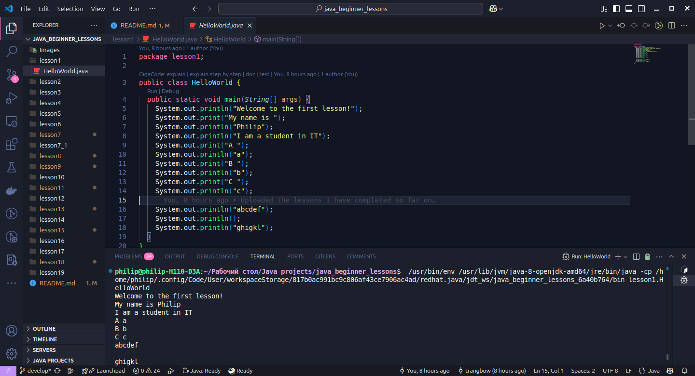

# Уроки для начинающих по Java

## Предварительные требования

Для успешного прохождения курса необходимо:

### Программное обеспечение

- Java Development Kit (JDK) 8 или выше
- Интегрированная среда разработки (IDE):
  - IntelliJ IDEA (рекомендуется)
  - Eclipse
  - Visual Studio Code с расширениями для Java
- Git для работы с репозиторием

### Базовые знания

- Основы работы с компьютером
- Понимание базовых концепций программирования
- Базовое знание английского языка для чтения технической документации

### Системные требования

- Минимум 4 ГБ оперативной памяти
- 2 ГБ свободного места на диске
- Операционная система:
  - Windows 7/8/10
  - macOS 10.14 или выше
  - Linux (любой современный дистрибутив)

## Содержание

1. [Урок 1: Вывод в консоль](#урок-1-вывод-в-консоль)
2. [Урок 2: Примитивные типы данных и литералы](#урок-2-примитивные-типы-данных-и-литералы)
3. [Урок 3: Арифметические, логические, операции присваивания и сравнения](#урок-3-арифметические-логические-операции-присваивания-и-сравнения)
4. [Урок 4: Основы ООП — Классы, объекты и ссылочные типы](#урок-4-основы-ооп--классы-объекты-и-ссылочные-типы)
5. [Урок 5: Создание объектов, конструкторы и вызов методов](#урок-5-создание-объектов-конструкторы-и-вызов-методов)
6. [Урок 6: Перегрузка методов и конструкторов (overloading). Ключевое слово this](#урок-6-перегрузка-методов-и-конструкторов-overloading-ключевое-слово-this)
7. [Урок 7: Понятие package. Модификаторы видимости (Access Modifiers)](#урок-7-понятие-package-модификаторы-видимости-access-modifiers)
8. [Урок 8: Понятие константа. Модификаторы «final» и «static»](#урок-8-понятие-константа-модификаторы-final-и-static)
9. [Урок 9: Разновидности переменных и пределы их видимости](#урок-9-разновидности-переменных-и-пределы-их-видимости)
10. [Урок 10: Понятия import и import static. Использование комментариев](#урок-10-понятия-import-и-import-static-использование-комментариев)
11. [Урок 11: Использование примитивных и ссылочных типов данных при вызове метода](#урок-11-использование-примитивных-и-ссылочных-типов-данных-при-вызове-метода)
12. [Урок 12: Конструкции if и if else. Ternary оператор](#урок-12-конструкции-if-и-if-else-ternary-оператор)
13. [Урок 13: Конструкция switch](#урок-13-конструкция-switch)
14. [Урок 14: Классический цикл for. Выражения break и continue](#урок-14-классический-цикл-for-выражения-break-и-continue)
15. [Урок 15: Циклы while и do while](#урок-15-циклы-while-и-do-while)
16. [Урок 16: Всё о классе String](#урок-16-всё-о-классе-string)
17. [Урок 17: Всё о классе StringBuilder](#урок-17-всё-о-классе-stringbuilder)
18. [Урок 18: Понятие массив. Работа с массивами](#урок-18-понятие-массив-работа-с-массивами)
19. [Урок 19: Параметры метода типа varargs. Аргументы типа command line. Цикл foreach](#урок-19-параметры-метода-типа-varargs-аргументы-типа-command-line-цикл-foreach)
20. [Урок 20: Всё о классе ArrayList](#урок-20-всё-о-классе-arraylist)
21. [Урок 21: Понятие инкапсуляция, наследование и модификатор protected](#урок-21-понятие-инкапсуляция-наследование-и-модификатор-protected)
22. [Урок 22: Перезаписанные и скрытые методы. Runtime binding и compile time binding](#урок-22-перезаписанные-и-скрытые-методы-runtime-binding-и-compile-time-binding)
23. [Урок 23: Абстрактные классы, абстрактные методы и интерфейсы](#урок-23-абстрактные-классы-абстрактные-методы-и-интерфейсы)
24. [Урок 24: Понятие полиморфизм. Операторы instanceof и приведение типов](#урок-24-понятие-полиморфизм-операторы-instanceof-и-приведение-типов)
25. [Урок 25: Методы equals() и toString(). Wrapper classes. Перегрузка методов и порядок инициализации](#урок-25-методы-equals-и-tostring-wrapper-classes-перегрузка-методов-и-порядок-инициализации)
26. [Урок 26: Исключения и их обработка. Try-catch blocks](#урок-26-исключения-и-их-обработка-try-catch-blocks)
27. [Урок 27: Классы LocalDate, LocalTime, LocalDateTime. Date-Time API](#урок-27-классы-localdate-localtime-localdatetime-date-time-api)
28. [Урок 28: Lambda выражения. Predicate интерфейс](#урок-28-lambda-выражения-predicate-интерфейс)

## Урок 1: Вывод в консоль

В этом уроке мы изучаем два основных метода вывода в консоль:

- **`System.out.println()`** — вывод с переводом строки.  
- **`System.out.print()`** — вывод без перевода строки.

```java
public class HelloWorld {
    public static void main(String[] args) {
        System.out.println("Hello World!"); // С переводом строки
        System.out.print("Hello "); // Без перевода строки
        System.out.print("World!"); // Продолжение на той же строке
    }
}
```


*Рис. 1.1 – Пример вывода*

Код урока доступен в файле:

- [HelloWorld.java](./lesson1/HelloWorld.java)

<div align="right">
  <b><a href="#содержание">↥ Вернуться к оглавлению</a></b>
</div>

---

## Урок 2: Примитивные типы данных и литералы

В этом уроке рассматриваются:

- Примитивные типы данных:
  - Целочисленные: `byte`, `short`, `int`, `long`
  - С плавающей точкой: `float`, `double`
  - Символьный: `char`
  - Логический: `boolean`
- Представление чисел в двоичном, восьмеричном и шестнадцатиричном форматах
- Использование литерала с подчеркиванием (начиная с Java 7)

### Примитивные типы данных

| Тип | Размер | Диапазон | Пример |
|-----|--------|----------|---------|
| byte | 8 бит | -128 до 127 | `byte b = 100;` |
| short | 16 бит | -32,768 до 32,767 | `short s = 1000;` |
| int | 32 бита | -2^31 до 2^31-1 | `int i = 10000;` |
| long | 64 бита | -2^63 до 2^63-1 | `long l = 100000L;` |
| float | 32 бита | ~3.4e-038 до ~3.4e+038 | `float f = 123.45f;` |
| double | 64 бита | ~1.7e-308 до ~1.7e+308 | `double d = 123.45;` |
| char | 16 бит | 0 до 65,535 | `char c = 'A';` |
| boolean | - | true или false | `boolean b = true;` |

### Форматы записи чисел

```java
// Десятичный
int decimal = 123;

// Двоичный (0b prefix)
int binary = 0b1111011;

// Восьмеричный (0 prefix)
int octal = 0173;

// Шестнадцатеричный (0x prefix)
int hex = 0x7B;

// С подчеркиванием
int million = 1_000_000;
```

Код урока доступен в файле:

- [PrimitiveDataTypes.java](./lesson2/PrimitiveDataTypes.java)

<div align="right">
  <b><a href="#содержание">↥ Вернуться к оглавлению</a></b>
</div>

---

## Урок 3: Арифметические, логические, операции присваивания и сравнения

В этом уроке рассматриваются основные типы операций в Java:

1. **Арифметические:** `+`, `-`, `*`, `/`, `%`
2. **Операции сравнения:** `==`, `!=`, `>`, `<`, `>=`, `<=`
3. **Логические операции:** `&&`, `||`, `!`
4. **Операции присваивания:** `=`, `+=`, `-=`, `*=`, `/=`

### Примеры

#### Арифметические операции

```java
int a = 10, b = 3;
System.out.println("Сложение: " + (a + b)); // 13
System.out.println("Вычитание: " + (a - b)); // 7
System.out.println("Умножение: " + (a * b)); // 30
System.out.println("Деление: " + (a / b)); // 3
System.out.println("Остаток от деления: " + (a % b)); // 1
```

#### Операции сравнения

```java
int x = 5, y = 10;
System.out.println("Равно: " + (x == y)); // false
System.out.println("Не равно: " + (x != y)); // true
System.out.println("Больше: " + (x > y)); // false
System.out.println("Меньше: " + (x < y)); // true
System.out.println("Больше или равно: " + (x >= y)); // false
System.out.println("Меньше или равно: " + (x <= y)); // true
```

#### Логические операции

```java
boolean p = true, q = false;
System.out.println("И (AND): " + (p && q)); // false
System.out.println("ИЛИ (OR): " + (p || q)); // true
System.out.println("НЕ (NOT): " + (!p)); // false
```

#### Операции присваивания

```java
int num = 5;
num += 3; // num = num + 3
System.out.println("После += : " + num); // 8
num *= 2; // num = num * 2
System.out.println("После *= : " + num); // 16
num -= 4; // num = num - 4
System.out.println("После -= : " + num); // 12
num /= 3; // num = num / 3
System.out.println("После /= : " + num); // 4
```

Код урока доступен в файле: [ArithmeticAndLogicaAndAssignmentAndRelationalOperations.java](./lesson3/ArithmeticAndLogicaAndAssignmentAndRelationalOperations.java).

<div align="right">
  <b><a href="#содержание">↥ Вернуться к оглавлению</a></b>
</div>

---

## Урок 4: Основы ООП — Классы, объекты и ссылочные типы

### Основные концепции

- **Класс** — шаблон/чертеж для создания объектов
- **Объект** — экземпляр класса в памяти
- **Ссылочный тип** — тип данных, хранящий ссылку на объект

### Отличия от примитивных типов

| Характеристика | Примитивные типы | Ссылочные типы |
|----------------|------------------|-----------------|
| Хранение | Значение напрямую | Ссылка на объект |
| Размер | Фиксированный | Зависит от объекта |
| Инициализация | Обязательна | По умолчанию `null` |
| Примеры | `int`, `boolean` и т.д. | `String`, массивы, классы |

### Пример классов

```java
public class Car {
    // Поля класса
    String color = "red";
    String engine = "v6";
}
```

```java
public class BankAccount {
    // Поля класса
    int id;
    String name;
    double balance;
}
```

Код урока доступен в файлах:

- [Car.java](./lesson4/Car.java)
- [BankAccount.java](./lesson4/BankAccount.java)

<div align="right">
  <b><a href="#содержание">↥ Вернуться к оглавлению</a></b>
</div>

---

## Урок 5: Создание объектов, конструкторы и вызов методов

В этом уроке рассматриваются:

- Процесс создания объектов
- Концепция конструктора
- Объявление и вызов методов

### Создание объектов

```java
public class Car {
    String color;
    String engine;
    
    // Конструктор
    Car(String color, String engine) {
        this.color = color;
        this.engine = engine;
    }
}

// Создание объекта
Car myCar = new Car("red", "V6");
```

### Конструкторы

```java
public class Human {
    String name;
    Car car;
    BankAccount account;
    
    // Конструктор без параметров
    Human() {
        this("Default", null, null);
    }
    
    // Конструктор с параметрами
    Human(String name, Car car, BankAccount account) {
        this.name = name;
        this.car = car;
        this.account = account;
    }
}
```

### Методы

```java
public class Car2 {
    String color;
    String engine;
    int speed;
    
    // Метод увеличения скорости
    int accelerate(int acceleration) {
        speed += acceleration;
        return speed;
    }
    
    // Метод уменьшения скорости
    int brake(int deceleration) {
        speed -= deceleration;
        return speed;
    }
}
```

### Вызов методов

```java
class Car2Test {
    public static void main(String[] args) {
        Car2 car = new Car2();
        car.speed = 60;

        // Вызов методов
        car.accelerate(20);  // speed = 80
        car.brake(80);       // speed = 0
    }
}
```

### Пример работы с методами: создание и вызов

```java
public class ConceptAndMethodCall {
  int sum(int a, int b, int c) {
    return a + b + c;
  }

  int average(int a, int b, int c) {
    return sum(a, b, c) / 3;
  }
}

class Test {
  public static void main(String[] args) {
    ConceptAndMethodCall obj = new ConceptAndMethodCall();
    System.out.println("Sum: " + obj.sum(10, 20, 30));
    System.out.println("Average: " + obj.average(20, 40, 60));
  }
}
```

Код урока доступен в файлах:

- [Car.java](./lesson5/Car.java)
- [Car2.java](./lesson5/Car2.java)
- [ConceptAndMethodCall.java](./lesson5/ConceptAndMethodCall.java)
- [Human.java](./lesson5/Human.java)

<div align="right">
  <b><a href="#содержание">↥ Вернуться к оглавлению</a></b>
</div>

---

## Урок 6: Перегрузка методов и конструкторов (`overloading`). Ключевое слово `this`

В этом уроке рассматриваются:

- Перегрузка (`overloading`) методов и конструкторов
- Использование ключевого слова `this`

### Перегрузка методов

Перегрузка позволяет объявлять несколько методов с одинаковым именем, но разными параметрами.  

```java
public class MathUtils {
    // Метод с одним параметром
    int sum(int a) {
        return a;
    }
    
    // Перегруженный метод с двумя параметрами
    int sum(int a, int b) {
        return a + b;
    }
}
```

### Перегрузка конструкторов

Перегрузка конструкторов позволяет создавать объекты разными способами.

```java
public class Car {
    String model;
    int year;

    // Конструктор без параметров
    public Car() {
        this("Unknown", 2000);
    }

    // Конструктор с параметрами
    public Car(String model, int year) {
        this.model = model;
        this.year = year;
    }
}
```

### Использование ключевого слова `this`

- Для обращения к полям класса
- Для вызова других конструкторов
- Для передачи текущего объекта

```java
public class Employee {
    String name;
    int age;
    
    // Использование this для полей
    public Employee(String name, int age) {
        this.name = name;
        this.age = age;
    }
    
    // Использование this() для вызова другого конструктора
    public Employee() {
        this("Unknown", 0);
    }
}
```

Код урока доступен в файлах:

- [MethodOverloading.java](./lesson6/MethodOverloading.java)
- [MethodOverloading2.java](./lesson6/MethodOverloading2.java)
- [EmployeeConstructorOverloading.java](./lesson6/EmployeeConstructorOverloading.java)

<div align="right">
  <b><a href="#содержание">↥ Вернуться к оглавлению</a></b>
</div>

---

## Урок 7: Понятие `package`. Модификаторы видимости (Access Modifiers)

В этом уроке рассматриваются:

- Понятие `package` и его использование
- Модификаторы доступа (`private`, `default`, `protected`, `public`)

### Пакеты (`package`)

Пакеты используются для организации классов и предотвращения конфликтов имен.  
Пример объявления пакета:  

```java
package lesson7;

public class Example {
    public void showMessage() {
        System.out.println("Hello from package lesson7!");
    }
}
```

Использование класса из другого пакета:

```java
import lesson7.Example;

public class Main {
    public static void main(String[] args) {
        Example ex = new Example();
        ex.showMessage();
    }
}
```

### Модификаторы доступа

Определяют область видимости классов, полей и методов.

| Модификатор | Видимость внутри класса | Видимость внутри пакета | Видимость в подклассах | Видимость в других пакетах |
|-------------|-------------------------|-------------------------|----------------------|---------------------------|
| private | ✅ | ❌ | ❌ | ❌ |
| (default) | ✅ | ✅ | ❌ | ❌ |
| protected | ✅ | ✅ | ✅ | ❌ |
| public | ✅ | ✅ | ✅ | ✅ |

### Пример модификаторов доступа

```java
package lesson7;

public class AccessExample {
    private int privateVar = 1;
    int defaultVar = 2;
    protected int protectedVar = 3;
    public int publicVar = 4;
}
```

Использование в другом классе в том же пакете:

```java
package lesson7;

public class TestAccess {
    public static void main(String[] args) {
        AccessExample example = new AccessExample();
        // example.privateVar; // Ошибка: private-поле недоступно
        System.out.println(example.defaultVar);  // Доступно
        System.out.println(example.protectedVar); // Доступно
        System.out.println(example.publicVar);    // Доступно
    }
}
```

Код урока доступен в файлах:

- [A.java](./lesson7/A.java)
- [B.java](./lesson7/B.java)
- [Employee.java](./lesson7/Employee.java)
- [OtherClass.java](./lesson7/OtherClass.java)
- [ThirdClass.java](./lesson7_1/ThirdClass.java)

<div align="right">
  <b><a href="#содержание">↥ Вернуться к оглавлению</a></b>
</div>

---

## Урок 8: Понятие `константа`. Модификаторы «final» и «static»

В этом уроке рассматриваются:

- Понятие `константа` и его использование
- Модификаторы (`final`, `static`)

### `final` — неизменяемость

Модификатор `final` делает переменные, методы и классы неизменяемыми.

#### 1. `final` для переменных

Переменная с `final` может быть присвоена только один раз.

```java
public class FinalExample {
    final int CONSTANT = 10;

    void changeValue() {
        // CONSTANT = 20; // Ошибка: нельзя изменить final-переменную
    }
}
```

#### 2. `final` для методов

Методы с `final` нельзя переопределить в наследуемых классах.

```java
class Parent {
    final void show() {
        System.out.println("This is a final method.");
    }
}

class Child extends Parent {
    // void show() { } // Ошибка: нельзя переопределить final-метод
}
```

#### 3. `final` для классов

Класс с `final` нельзя унаследовать.

```java
final class UnmodifiableClass {
}

// class SubClass extends UnmodifiableClass {} // Ошибка: нельзя наследовать final-класс
```

### `static` — принадлежность классу

Модификатор `static` делает переменные и методы принадлежащими классу, а не объектам.

#### 1. `static` переменные

Общие для всех экземпляров класса.

```java
class Counter {
    static int count = 0;

    Counter() {
        count++;
    }
}

public class Main {
    public static void main(String[] args) {
        Counter c1 = new Counter();
        Counter c2 = new Counter();
        System.out.println(Counter.count); // Выведет: 2
    }
}
```

#### 2. `static` методы

Могут вызываться без создания объекта.

```java
class StaticMethodExample {
    static void greet() {
        System.out.println("Hello, world!");
    }
}

public class Main {
    public static void main(String[] args) {
        StaticMethodExample.greet(); // Вывод: Hello, world!
    }
}
```

#### 3. `static` блок

Выполняется один раз при загрузке класса.

```java
class StaticBlockExample {
    static {
        System.out.println("Static block executed.");
    }
}

public class Main {
    public static void main(String[] args) {
        new StaticBlockExample();
        new StaticBlockExample();
    }
}
// Выведет "Static block executed." только один раз
```

### Константы (`static final`)

Переменные, которые нельзя изменить и которые принадлежат классу.

```java
class MathConstants {
    static final double PI = 3.1415926535;
}

public class Main {
    public static void main(String[] args) {
        System.out.println(MathConstants.PI); // Вывод: 3.1415926535
    }
}
```

Код урока доступен в файлах:

- [Car.java](./lesson8/Car.java)
- [Student.java](./lesson8/Student.java)
- [NonAccessModify.java](./lesson8/NonAccessModify.java)
- [StudentNonAccessStatic.java](./lesson8/StudentNonAccessStatic.java)

<div align="right">
  <b><a href="#содержание">↥ Вернуться к оглавлению</a></b>
</div>

---

## Урок 9: Разновидности переменных и пределы их видимости

В этом уроке рассматриваются:

- Виды переменных в Java
- Их область видимости и срок жизни
- Отличия между локальными, экземплярными и статическими переменными

### Виды переменных

| Тип переменной | Где объявляется | Доступность | Срок жизни |
|---------------|-----------------|-------------|------------|
| Локальная | Внутри метода | Только в этом методе | Пока выполняется метод |
| Экземпляра | Внутри класса (без `static`) | Для каждого объекта отдельно | Пока объект существует |
| Статическая | Внутри класса с `static` | Одна на весь класс | Пока работает программа |

### Локальные переменные

Создаются внутри методов и доступны только там.  
**Важно:** локальные переменные **не имеют значений по умолчанию** и **должны быть инициализированы**.

```java
public void changeColor(String color) {
    System.out.println("Новый цвет автомобиля: " + color);
    @SuppressWarnings("unused") int price = 5000; // Локальная переменная
    price += 5000;
}
```

- Локальные переменные нельзя объявлять с модификаторами доступа (`public`, `private`)
- Они недоступны за пределами метода

### Переменные экземпляра (поля класса)

Хранят данные объекта и могут использоваться в разных методах.

```java
public class TypesOfVariablesAndLimitsOfTheirVisibilityCar {
    String color; // Переменная экземпляра
    int a = 10;
}
```

- Инициализируются автоматически (0 для чисел, false для `boolean`, `null` для объектов)
- У каждой копии объекта свои значения

Использование:

```java
public void showColor() {
    System.out.println("Цвет автомобиля: " + color);
    changeColor("red");
}
```

### Статические переменные (переменные класса)

Общие для всех экземпляров класса.

```java
public static int count; // Статическая переменная
```

- Существуют независимо от объектов
- Меняются глобально для всех экземпляров

Пример использования:

```java
public TypesOfVariablesAndLimitsOfTheirVisibilityCar(String color, String engine) {
    this.color = color;
    this.engine = engine;
    count++; // Увеличение общего счетчика
}
```

### Особенности именования переменных

Разрешенные имена:

```java
int aTypeOfWritingAvariable = 10;
int ATypeOfWritingAvariable = 10;
int _TypeOfWritingAvariable = 10;
int $TypeOfWritingAvariable = 10;
int atypeOfWritingAvariable56 = 10;
```

Запрещенные:

```java
int 56atype0fWritingAvariable = 10;  // Нельзя начинать с цифры
int static = 10;  // Ключевое слово
int int = 10;
int boolean = 10;
int class = 10;
```

Разрешено, но не рекомендуется:

```java
int String = 10;
int Class = 10;
```

Рекомендуемая практика написания констант:

```java
final int NOT_ALLOWED_TO_CHANGE_THIS_VALUE = 10; // Константа
```

### Использование `this`

Ключевое слово `this` используется для обращения к полям экземпляра внутри методов.

```java
public TypesOfVariablesAndLimitsOfTheirVisibilityCar(String color, String engine) {
    this.color = color;
    this.engine = engine;
}
```

В методах `this` **не обязателен**, но его можно использовать:

```java
public void showColor() {
    System.out.println("Цвет автомобиля: " + color);
    this.changeColor("black"); // Использование this
}
```

Код урока доступен в файлах:

- [TypesOfVariablesAndLimitsOfTheirVisibilityCar.java](./lesson9/TypesOfVariablesAndLimitsOfTheirVisibilityCar.java)
- [Student.java](./lesson9/Student.java)

<div align="right">
  <b><a href="#содержание">↥ Вернуться к оглавлению</a></b>
</div>

---

## Урок 10: Понятия `import` и `import static`. Использование комментариев

В этом уроке рассматриваются:

- Понятия `import` и `import static`
- Использование и виды комментариев

### `import` и `import static`

В Java классы из других пакетов можно импортировать с помощью `import`, а статические методы и переменные — с помощью `import static`.

### Обычный импорт

```java
import lesson9.TypesOfVariablesAndLimitsOfTheirVisibilityCar;
import lesson9.Student;
```

- Позволяет использовать классы без указания полного пути
- **Не увеличивает размер файла**
- **Нельзя импортировать два класса с одинаковым именем из разных пакетов**

```java
// Ошибка! Нельзя импортировать две версии класса Student
import lesson9.Student;
import lesson8.Student;
```

Если классы имеют одинаковые имена, **используем полный путь**:

```java
lesson9.Student student1 = new lesson9.Student();
lesson8.Student student2 = new lesson8.Student();
```

### Импорт всех классов пакета

```java
import lesson9.*;
import lesson8.*;
```

- Позволяет импортировать **все классы** из пакета
- **Не импортирует классы из подпакетов**

```java
// Ошибка! lesson9.subpackage.* не импортируется автоматически
import lesson9.*;
import lesson9.subpackage.*;
```

### import static

Позволяет использовать **статические** методы и переменные **без указания имени класса**.

```java
import static lesson9.TypesOfVariablesAndLimitsOfTheirVisibilityCar.count;
```

Эквивалентно:

```java
System.out.println(lesson9.TypesOfVariablesAndLimitsOfTheirVisibilityCar.count);
```

С **import static** можно просто написать:

```java
System.out.println(count);
```

Импорт всех статических элементов:

```java
import static lesson9.TypesOfVariablesAndLimitsOfTheirVisibilityCar.*;
```

### Комментарии в Java

| Тип | Синтаксис | Описание |
|-----|-----|-----|
| Однострочный | `//` | Комментарий до конца строки |
| Многострочный | `/* ... */` | Комментарий на несколько строк |
| Javadoc | `/** ... */` | Документация для классов и методов |

Примеры:

```java
// Однострочный комментарий
int a = 5; // Может быть после выражения

/* 
   Многострочный комментарий 
   Используется для больших блоков текста 
*/

/**
 * Javadoc-комментарий
 * @author Автор
 * @version 1.0
 */
public class Example { }
```

Javadoc-генератор создает HTML-документацию на основе комментариев `/** ... */`.

Код урока доступен в файле:

- [ConceptOfImportAndStaticImportAndViewComments.java](./lesson10/ConceptOfImportAndStaticImportAndViewComments.java)

<div align="right">
  <b><a href="#содержание">↥ Вернуться к оглавлению</a></b>
</div>

---

## Урок 11: Использование примитивных и ссылочных типов данных при вызове метода

В этом уроке рассматриваются:

- Передача **примитивных** типов данных в методы
- Передача **ссылочных** типов данных в методы
- Влияние изменений в методе на исходные переменные

### Передача примитивных типов

Примитивные типы (например, `int`, `double`) передаются **по значению** — передается копия числа, а не сама переменная.

```java
public double doubling(double a) {
    a = a * 2;
    return a;
}
```

Вызов метода:

```java
ArgumentsMethodEmployee employee1 = new ArgumentsMethodEmployee("Max", 500);
double result = employee1.doubling(employee1.salary);
System.out.println("Value a, not salary = " + result);
System.out.println("Salary = " + employee1.salary);
```

Вывод:

```java
Value a, not salary = 1000.0
Salary = 500.0
```

- **Исходная переменная** `salary` **не изменилась**, так как метод работал с копией значения.

### Передача ссылочных типов

Ссылочные типы (объекты) передаются по значению ссылки, но сам объект можно изменять.

```java
public static void changeName(ArgumentsMethodStudent student) {
    student.name = "Kolya";
}
```

Вызов метода:

```java
ArgumentsMethodStudent st1 = new ArgumentsMethodStudent("Ivan", 3, 9.5);
changeName(st1);
System.out.println(st1.name);
```

Вывод:

```bash
Kolya
```

- **Объект изменился**, так как метод модифицировал его поле `name`.

### Попытка обмена объектов (не сработает)

```java
public static void swap(ArgumentsMethodStudent student1, ArgumentsMethodStudent student2) {
    ArgumentsMethodStudent temp = student1;
    student1 = student2;
    student2 = temp;
}
```

Вызов:

```java
ArgumentsMethodStudent st1 = new ArgumentsMethodStudent("Ivan", 3, 9.5);
ArgumentsMethodStudent st2 = new ArgumentsMethodStudent("Petr", 1, 5.3);
swap(st1, st2);
System.out.println(st1.name);
System.out.println(st2.name);
```

Вывод:

```bash
Ivan
Petr
```

- **Переменные** `st1` **и** `st2` **не поменялись местами**, так как в метод передаются копии ссылок.

Код урока доступен в файлах:

- [ArgumentsMethodEmployee.java](./lesson11/ArgumentsMethodEmployee.java)
- [ArgumentsMethodStudent.java](./lesson11/ArgumentsMethodStudent.java)

<div align="right">
  <b><a href="#содержание">↥ Вернуться к оглавлению</a></b>
</div>

---

## Урок 12: Конструкции `if` и `if else`. Ternary оператор

В этом уроке рассматриваются:

- Использование условных операторов `if` и `if else`
- Применение тернарного оператора `? :` для выбора значений

### Конструкция `if`

Позволяет выполнить код, если условие истинно (`true`).

```java
if (a > b) {
    System.out.println("a больше b");
}
```

- Если a > b, сообщение будет выведено.

### Конструкция `if else`

Используется, когда нужно разные действия в зависимости от условия.

```java
if (a > b) {
    System.out.println("a больше b");
} else {
    System.out.println("b больше либо равно a");
}
```

- Если `a > b`, выполняется первый блок
- Если `a <= b`, выполняется `else`

### `if else if` (много условий)

Используется, когда есть несколько альтернатив.

```java
void max(int a, int b, int c) {
    if (a > b && a > c) {
        System.out.println("a is maximum");
    } else if (b > a && b > c) {
        System.out.println("b is maximum");
    } else {
        System.out.println("c is maximum");
    }
}
```

### Тернарный оператор `? :`

Позволяет заменить `if else` для присваивания значений.

Формат:

```java
переменная = (условие) ? значение_если_true : значение_если_false;
```

Пример:

```java
int a = 10;
int b = 15;
int max = (a > b) ? a : b;
System.out.println("Max: " + max);
```

Вывод:

```bash
Max: 15
```

### Сравнительная таблица условных конструкций

| Конструкция | Применение | Особенности |
|-------------|------------|-------------|
| `if` | Простая проверка условия | Только один блок кода |
| `if else` | Выбор из двух вариантов | Всегда выполняется один из блоков |
| `if else if` | Множественный выбор | Проверка нескольких условий |
| Тернарный оператор | Присваивание по условию | Компактная запись для простых условий |

Код урока доступен в файле:

- [FlowControlIfAndIfElseAndTernaryOperator.java](./lesson12/FlowControlIfAndIfElseAndTernaryOperator.java)

<div align="right">
  <b><a href="#содержание">↥ Вернуться к оглавлению</a></b>
</div>

---

## Урок 13: Конструкция `switch`

В этом уроке рассматриваются:

- Использование `switch` для выбора одного из нескольких вариантов
- Правила работы и допустимые типы данных в `switch`
- Особенности и ограничения `switch`

### `switch` — альтернатива `if else`

Конструкция `switch` позволяет заменить множественные `if else`, когда сравниваем одно значение.

```java
switch (выражение) {
    case значение1:
        // код
        break;
    case значение2:
        // код
        break;
    default:
        // код, если нет совпадений
}
```

### Допустимые типы данных

В `switch` можно использовать:
✅ `byte`, `short`, `char`, `int`
✅ `String` (начиная с Java 7)
✅ `enum`

❌ **Нельзя** использовать:

- `double`, `float`, `long`
- Объекты (`Object`, `List` и т.д.)

### Пример switch

```java
class Student {
    int grade;

    Student(int grade) {
        this.grade = grade;
    }

    public static void main(String[] args) {
        Student student = new Student(2);

        switch (student.grade) {
            case 2:
                System.out.println("Unsatisfactory");
                break;
            case 3:
                System.out.println("Satisfactorily");
                break;
            case 4:
                System.out.println("Good");
                break;
            case 5:
                System.out.println("Great");
                break;
            default:
                System.out.println("Unknown score");
        }
    }
}
```

### `case` и `final` переменные

✅ **Можно использовать final переменные**, если они константы времени компиляции:

```java
final int C = 1;
switch (C) {
    case 1:
        System.out.println("Case 1");
        break;
}
```

❌ **Нельзя использовать переменные, вычисляемые во время выполнения**:

```java
int a = 2;
switch (a) {  
    case a * 2:  // Ошибка! `a * 2` вычисляется во время работы программы
        System.out.println("Ошибка!");
        break;
}
```

### `default` в `switch`

- Срабатывает, если нет совпадений с `case`
- Аналог `else` в `if else`

```java
switch (value) {
    case 1:
        System.out.println("Один");
        break;
    case 2:
        System.out.println("Два");
        break;
    default:
        System.out.println("Неизвестное значение");
}
```

### Сравнительная таблица с if-else

| Характеристика | switch | if-else |
|----------------|---------|----------|
| Читаемость | Выше при множестве вариантов | Лучше для 2-3 условий |
| Производительность | Выше (jump table) | Ниже (последовательные проверки) |
| Гибкость условий | Только равенство | Любые условия |
| Типы данных | Ограниченный набор | Любые boolean выражения |

Код урока доступен в файле:

- [SwitchStatement.java](./lesson13/SwitchStatement.java)

<div align="right">
  <b><a href="#содержание">↥ Вернуться к оглавлению</a></b>
</div>

---

## Урок 14: Классический цикл `for`. Выражения `break` и `continue`

В этом уроке рассматриваются:

- Структура цикла `for`
- Вложенные циклы
- Операторы `break` и `continue`
- Маркированные циклы (labeled loops)
- Ошибки `unreachable statement`

### Основной синтаксис `for`

Цикл `for` используется, когда известно количество повторений.

```java
for (инициализация; условие; обновление) {
    // тело цикла
}
```

Пример вывода сообщения 10 раз:

```java
for (int i = 0; i < 10; i++) {
    System.out.println("Lesson №14");
}
```

Объяснение:

- `int i = 0;` – объявляем счетчик
- `i < 10;` – условие выполнения
- `i++` – увеличиваем `i` после каждого шага

### Вложенные циклы

Пример вывода часов и минут:

```java
for (int hour = 0; hour < 24; hour++) {
    for (int minute = 0; minute < 60; minute++) {
        System.out.println(hour + ":" + minute);
    }
}
```

### `break` и `continue`

- `break` - прерывает выполнение цикла
- `continue` - пропускает текущую итерацию

```java
for (int i = 1; i <= 10; i++) {
    if (i == 5) continue; // Пропускаем 5
    if (i == 7) break;    // Прерываем на 7
    System.out.println(i);
}
```

Вывод:

```bash
1  
2  
3  
4  
6  
```

### Маркированные циклы (labeled loops)

Позволяют управлять конкретным циклом во вложенных конструкциях.

```java
OUTER:
for (int hour = 0; hour < 24; hour++) {
    for (int minute = 0; minute < 60; minute++) {
        if (minute == 20) continue OUTER; // Перейти к следующему часу
        if (minute == 30) break OUTER;    // Выйти из внешнего цикла
        System.out.println(hour + ":" + minute);
    }
}
```

### `Unreachable statement`

Ошибка компиляции возникает, если код никогда не выполнится.

```java
// Ошибка: условие всегда false
for (int i = 0; false; i++) { 
    System.out.println(i);
}

// Никогда не выполнится
if (10 < 3) { 
    System.out.println("Невыполнимый код");
}
```

### Сравнительная таблица операторов управления циклом

| Оператор | Действие | Применение |
|----------|----------|------------|
| `break` | Прерывает цикл | Выход из цикла досрочно |
| `continue` | Пропускает итерацию | Пропуск определённых значений |
| `break LABEL` | Прерывает помеченный цикл | Выход из вложенных циклов |
| `continue LABEL` | Переход к следующей итерации помеченного цикла | Управление вложенными циклами |

Код урока доступен в файлах:

- [ClassicalCycleFor.java](./lesson14/ClassicalCycleFor.java)
- [ClassicalCycleForNestedLoop.java](./lesson14/ClassicalCycleForNestedLoop.java)
- [ClassicalCycleForUnreachableStatement.java](./lesson14/ClassicalCycleForUnreachableStatement.java)
- [StatementBreakAndContinue.java](./lesson14/StatementBreakAndContinue.java)

<div align="right">
  <b><a href="#содержание">↥ Вернуться к оглавлению</a></b>
</div>

---

## Урок 15: Циклы `while` и `do while`

В этом уроке рассматриваются:

- Цикл `while`
- Цикл `do while`
- Использование `break` и `continue`
- Метки для циклов (labeled loops)

### Цикл while

Используется, когда количество итераций заранее неизвестно, но есть условие.

```java
public class CycleWhileAndDoWhile {
    public static void main(String[] args) {
        int i = 1;
        while (i <= 10) {
            System.out.println(i);
            i++;
        }
    }
}
```

Работа кода:

1. Проверяется условие `i <= 10`
2. Если `true` → выполняется тело цикла
3. `i++` увеличивает счетчик
4. Повторяется, пока `i` не станет 11

### Цикл do while

Гарантирует хотя бы одну итерацию, даже если условие изначально `false`.

```java
public class DoWhileExample {
    public static void main(String[] args) {
        int j = 1;
        do {
            System.out.println(j);
            j++;
        } while (j <= 10);
    }
}
```

Отличия от `while`:

- `while` → проверка **до** выполнения кода
- `do while` → проверка **после** выполнения кода

### Прерывание циклов: break и continue

```java
public class BreakContinueExample {
    public static void main(String[] args) {
        int a = 1;
        while (true) { 
            System.out.println(a);
            if (a % 3 == 0 && a % 7 == 0) {
                break; // Прерывание цикла
            }
            a++;
        }
    }
}
```

### Использование меток (labeled loops)

```java
public class LabeledLoopExample {
    public static void main(String[] args) {
        OUTER: 
        do {
            int min = 0;
            INNER:
            while (min < 60) {
                if (min == 20) {
                    continue OUTER; // Переход к внешнему циклу
                }
                System.out.println(min);
                min++;
            }
        } while (false);
    }
}
```

### Сравнение while и do while

| Характеристика | while | do while |
|----------------|-------|-----------|
| Проверка условия | В начале | В конце |
| Минимум итераций | 0 | 1 |
| Применение | Неизвестное количество повторений | Нужна минимум одна итерация |

### Особенности работы с циклами

1. `break` - полностью прерывает цикл
2. `continue` - пропускает текущую итерацию
3. Метки позволяют управлять вложенными циклами
4. Бесконечный цикл создаётся через `while(true)`

Код урока доступен в файле:

- [CycleWhileAndDoWhile.java](./lesson15/CycleWhileAndDoWhile.java)

<div align="right">
  <b><a href="#содержание">↥ Вернуться к оглавлению</a></b>
</div>

---

## Урок 16: Всё о классе `String`

В этом уроке рассматриваются:

- Создание строк и их различия в памяти
- Сравнение строк
- Методы работы со строками
- String Pool и размещение строк в памяти

### Создание строк

Строки в Java могут быть созданы двумя способами:

```java
// Через литералы (String Pool)
String str4 = "Good morning";  // Размещается в String Pool
String str5 = "Good morning";  // Ссылается на тот же объект

// Через конструктор (Heap)
String str1 = new String("Good morning");  // Создает новый объект
String str2 = new String("Bad day");       // Создает новый объект
```

### Сравнение строк

```java
// Сравнение ссылок (не рекомендуется для значений)
System.out.println(str1 == str2);        // false
System.out.println(str4 == str5);        // true (один объект в пуле)

// Правильное сравнение значений
System.out.println(str1.equals(str2));   // false
System.out.println(str4.equals(str5));   // true
```

### Основные методы String

```java
// Доступ к символам
char first = str1.charAt(0);         // 'G'
char fifth = str1.charAt(5);         // 'm'

// Длина строки
int length = str1.length();          // 12

// Преобразование регистра
String upper = str1.toUpperCase();   // "GOOD MORNING"
String lower = str1.toLowerCase();   // "good morning"

// Поиск
int index = str1.indexOf('m');       // 5
int lastIndex = str1.lastIndexOf('g'); // 10

// Подстроки
String sub1 = str1.substring(0, 4);  // "Good"
String sub2 = str1.substring(5);     // "morning"

// Замена символов
String replaced = str1.replace(' ', '-');  // "Good-morning"

// Удаление пробелов
String trimmed = "  Hello  ".trim();  // "Hello"

// Проверка содержимого
boolean starts = str1.startsWith("Good");  // true
boolean ends = str1.endsWith("ing");       // true
boolean contains = str1.contains("mor");   // true
```

### Сравнительная таблица методов String

| Метод | Описание | Пример |
|-------|----------|--------|
| `charAt()` | Получение символа по индексу | `str.charAt(0)` |
| `length()` | Длина строки | `str.length()` |
| `substring()` | Получение подстроки | `str.substring(0, 4)` |
| `toLowerCase()` | Преобразование в нижний регистр | `str.toLowerCase()` |
| `toUpperCase()` | Преобразование в верхний регистр | `str.toUpperCase()` |
| `trim()` | Удаление крайних пробелов | `str.trim()` |
| `replace()` | Замена символов/подстрок | `str.replace('a', 'b')` |
| `contains()` | Проверка наличия подстроки | `str.contains("abc")` |

### Особенности String в Java

1. Строки неизменяемы (immutable)
2. При создании через литералы используется String Pool
3. Конкатенация создает новый объект
4. Сравнение через equals() вместо ==
5. Индексация начинается с 0

### Оптимизация работы со строками

```java
// Неэффективно
String result = "";
for (int i = 0; i < 100; i++) {
    result += i;  // Создает новый объект каждый раз
}

// Эффективно
StringBuilder sb = new StringBuilder();
for (int i = 0; i < 100; i++) {
    sb.append(i);  // Изменяет существующий объект
}
String result = sb.toString();
```

Код урока доступен в файле:

- [AllAboutClassString.java](./lesson16/AllAboutClassString.java)

<div align="right">
  <b><a href="#содержание">↥ Вернуться к оглавлению</a></b>
</div>

---

## Урок 17: Всё о классе `StringBuilder`

В этом уроке рассматриваются:

- Создание объектов StringBuilder
- Основные методы класса
- Сравнение производительности со String
- Работа с буфером символов

### Создание объектов StringBuilder

```java
// Различные способы создания
StringBuilder sb = new StringBuilder();           // Пустой (ёмкость 16)
StringBuilder sb1 = new StringBuilder("Hello");   // С начальной строкой
StringBuilder sb2 = new StringBuilder(50);        // С начальной ёмкостью
StringBuilder sb3 = new StringBuilder(sb1);       // Копия другого StringBuilder
```

### Основные методы

#### Информация о StringBuilder

```java
// Длина и ёмкость
int length = sb.length();          // Текущая длина
int capacity = sb.capacity();      // Текущая ёмкость
boolean isEmpty = sb.isEmpty();    // Проверка на пустоту
```

#### Модификация содержимого

```java
// Добавление контента
sb.append("Hello");               // В конец
sb.insert(0, "Start ");          // По индексу
sb.append(22).append(true);      // Цепочка вызовов

// Удаление контента
sb.delete(1, 3);                 // Диапазон
sb.deleteCharAt(0);              // Один символ

// Замена и разворот
sb.replace(0, 5, "Hi");          // Замена части
sb.reverse();                    // Разворот строки
```

#### Получение информации

```java
// Доступ к символам
char ch = sb.charAt(0);          // Получение символа
int idx = sb.indexOf("Hello");   // Поиск подстроки
String sub = sb.substring(0, 5); // Получение подстроки
```

### Сравнительная таблица String vs StringBuilder

| Характеристика | String | StringBuilder |
|----------------|--------|---------------|
| Изменяемость | Неизменяемый | Изменяемый |
| Thread-safety | Да | Нет |
| Производительность при конкатенации | Ниже | Выше |
| Использование памяти | Больше | Меньше |
| Синхронизация | Не требуется | Нет |

### Особенности работы

```java
StringBuilder sb = new StringBuilder("Hello");
String s = sb.append(" World").substring(sb.indexOf("W"));
System.out.println(s);           // "World"
```

### Основные сценарии использования

1. Множественные изменения строки
2. Построение строки в цикле
3. Конкатенация большого количества строк
4. Создание строки по шаблону

### Пример эффективного использования

```java
StringBuilder result = new StringBuilder();
for (int i = 0; i < 1000; i++) {
    result.append(i)
          .append(": ")
          .append("item")
          .append("\n");
}
String finalString = result.toString();
```

Код урока доступен в файле:

- [AllAboutClassStringBuilder.java](./lesson17/AllAboutClassStringBuilder.java)

<div align="right">
  <b><a href="#содержание">↥ Вернуться к оглавлению</a></b>
</div>

---

## Урок 18: Понятие массив. Работа с массивами

В этом уроке рассматриваются:

- Основы работы с массивами
- Динамическая инициализация
- Статическая инициализация
- Методы класса Arrays

### Динамическая инициализация массива

Размер массива задается во время выполнения программы.

```java
public class ArrayDynamicInitialization {
    public static void main(String[] args) {
        String[] array1;
        int[][] array2;
        
        // Инициализация массивов
        array1 = new String[3];
        array2 = new int[3][];
        
        // Заполнение одномерного массива
        for (int i = 0; i < array1.length; i++) {
            array1[i] = "Hello " + i;
            System.out.println(array1[i]);
        }
        
        // Инициализация двумерного массива
        array2[0] = new int[5];
        array2[1] = new int[2];
        array2[2] = new int[7];
        
        // Заполнение двумерного массива
        for (int i = 0; i < array2.length; i++) {
            for (int j = 0; j < array2[i].length; j++) {
                array2[i][j] = i + j;
                System.out.print(array2[i][j] + " ");
            }
            System.out.println();
        }
    }
}
```

### Статическая инициализация массива

Размер и значения массива определяются при объявлении.

```java
public class ArrayStaticInitialization {
    public static void main(String[] args) {
        // Объявление и инициализация
        int[] array1 = {1, 2, 3, 4, 5};
        String[] array2 = {"Hello", "World"};
        
        // Многомерные массивы
        int[][] array3 = {
            {1, 2},
            {3, 4, 5},
            {6}
        };
        
        // Ссылки на массивы
        double[] array5 = {2.5, 3.5};
        double[] array7 = array5;  // Копирование ссылки
    }
}
```

### Работа с классом Arrays

Класс `Arrays` предоставляет утилитарные методы для работы с массивами.

```java
public class ConsiderationOfTheArraysClassIsMinimal {
    public static void main(String[] args) {
        int array1[] = {1, 9, 3, -8, 0, 5, 4, 1};
        
        // Сортировка массива
        Arrays.sort(array1);
        
        // Бинарный поиск
        int index = Arrays.binarySearch(array1, -8);
        
        // Вывод массива
        System.out.println(Arrays.toString(array1));
    }
}
```

### Сравнительная таблица методов Arrays

| Метод | Описание | Пример |
|-------|----------|--------|
| `sort()` | Сортировка массива | `Arrays.sort(array)` |
| `binarySearch()` | Поиск элемента | `Arrays.binarySearch(array, key)` |
| `equals()` | Сравнение массивов | `Arrays.equals(array1, array2)` |
| `fill()` | Заполнение значением | `Arrays.fill(array, value)` |
| `toString()` | Строковое представление | `Arrays.toString(array)` |

### Особенности работы с массивами

1. Индексация начинается с 0
2. Длина массива фиксирована после создания
3. Массивы являются объектами
4. Элементы примитивных типов инициализируются нулевыми значениями
5. При выходе за границы возникает `ArrayIndexOutOfBoundsException`

Код урока доступен в файлах:

- [ArrayDynamicInitialization.java](./lesson18/ArrayDynamicInitialization.java)
- [ArrayStaticInitialization.java](./lesson18/ArrayStaticInitialization.java)
- [ConsiderationOfTheArraysClassIsMinimal.java](./lesson18/ConsiderationOfTheArraysClassIsMinimal.java)

<div align="right">
  <b><a href="#содержание">↥ Вернуться к оглавлению</a></b>
</div>

---

## Урок 19: Параметры метода типа `varargs`. Аргументы типа `command line`. Цикл `foreach`

В этом уроке рассматриваются:

- Параметры переменной длины (varargs)
- Работа с аргументами командной строки
- Использование цикла foreach
- Компиляция и запуск Java программ

### Параметры типа varargs

Varargs позволяют передавать переменное количество аргументов в метод. Они должны быть последним параметром.

```java
public class VariableArgumentsVarArgs {
    // Перегруженные методы
    static void sum(int a, int b) {
        System.out.println("Sum of two numbers: " + (a + b));
    }
    
    static void sum(int a, int b, int c) {
        System.out.println("Sum of three numbers: " + (a + b + c));
    }

    // Метод с varargs
    static void sum(int... numbers) {
        int sum = 0;
        for (int number : numbers) {
            sum += number;
        }
        System.out.println("Sum of variable arguments: " + sum);
    }
}
```

### Аргументы командной строки

Параметры программы передаются через массив `String[] args` в методе main.

```java
public class CommandLineArguments {
    public static void main(String[] args) {
        // Вывод первого аргумента
        System.out.println("First argument: " + args[0]);
        // Вывод количества аргументов
        System.out.println("Number of arguments: " + args.length);
    }
}
```

### Цикл foreach

Упрощенный способ перебора элементов массива или коллекции.

```java
public void abc(int[]... arrays) {
    for (int[] array : arrays) {        // Внешний foreach
        for (int number : array) {       // Внутренний foreach
            System.out.print(number + " ");
        }
        System.out.println();
    }
}
```

### Компиляция и запуск Java программ

| Команда | Описание |
|---------|-----------|
| `javac ClassName.java` | Компиляция исходного кода |
| `java ClassName` | Запуск программы |
| `java ClassName arg1 arg2` | Запуск с аргументами |

### Особенности varargs

| Характеристика | Описание | Пример |
|----------------|-----------|---------|
| Позиция | Только последний параметр | `void method(String s, int... nums)` |
| Тип | Создается массив | `int... nums` становится `int[] nums` |
| Количество | От 0 до множества | `sum()` или `sum(1,2,3,4,5)` |

### Примеры использования foreach

```java
// С массивом
int[] numbers = {1, 2, 3, 4, 5};
for (int num : numbers) {
    System.out.print(num + " ");
}

// С двумерным массивом
int[][] matrix = {{1,2}, {3,4}, {5,6}};
for (int[] row : matrix) {
    for (int num : row) {
        System.out.print(num + " ");
    }
}
```

### Примеры запуска с аргументами

```bash
# Компиляция
javac CommandLineArguments.java

# Запуск с аргументами
java CommandLineArguments 25 67 privet poka
```

Код урока доступен в файлах:

- [CommandLineArguments.java](./lesson19/CommandLineArguments.java)
- [VariableArgumentsVarArgs.java](./lesson19/VariableArgumentsVarArgs.java)

<div align="right">
  <b><a href="#содержание">↥ Вернуться к оглавлению</a></b>
</div>

---

## Урок 20: Всё о классе `ArrayList`

В этом уроке рассматриваются:

- Основы работы с `ArrayList`
- Методы для манипуляции данными
- Работа с итераторами
- Сравнение с обычными массивами

### Создание ArrayList

`ArrayList` - динамическая структура данных, автоматически расширяющаяся при добавлении элементов.

```java
// Различные способы создания
ArrayList<String> list1 = new ArrayList<>();           // Пустой список
ArrayList<String> list2 = new ArrayList<>(50);         // С начальной ёмкостью
ArrayList<String> list3 = new ArrayList<>(otherList);  // Копия существующего списка
```

### Основные методы `ArrayList`

#### Добавление элементов

```java
ArrayList<String> list = new ArrayList<>();
list.add("Java");                 // В конец списка
list.add(1, "Python");           // По индексу
list.addAll(anotherList);        // Добавление коллекции
list.addAll(1, anotherList);     // Добавление по индексу
```

#### Получение и изменение элементов

```java
String element = list.get(0);     // Получение элемента
list.set(1, "C++");              // Замена элемента
```

#### Удаление элементов

```java
list.remove(0);                   // По индексу
list.remove("Java");              // По значению
list.clear();                     // Удаление всех элементов
```

### Информационные методы

```java
int size = list.size();           // Размер списка
boolean isEmpty = list.isEmpty(); // Проверка на пустоту
boolean contains = list.contains("Java"); // Проверка наличия элемента
int index = list.indexOf("Java"); // Поиск первого вхождения
```

### Работа с итераторами

#### Iterator

```java
Iterator<String> iterator = list.iterator();
while (iterator.hasNext()) {
    String element = iterator.next();
    System.out.println(element);
}
```

#### ListIterator

```java
ListIterator<String> listIterator = list.listIterator();
while (listIterator.hasNext()) {
    listIterator.next();
    listIterator.remove();
}
```

### Преобразование ArrayList

```java
// В массив Object
Object[] array = list.toArray();

// В типизированный массив
String[] strArray = list.toArray(new String[0]);

// Из массива в List
String[] array = {"A", "B", "C"};
List<String> list = Arrays.asList(array);
```

### Сравнительная таблица Array vs ArrayList

| Характеристика | Array | ArrayList |
|----------------|-------|-----------|
| Размер | Фиксированный | Динамический |
| Производительность | Выше | Ниже |
| Примитивные типы | Да | Нет (только обёртки) |
| Многомерность | Да | Нет (требуется вложенность) |
| Обобщения (Generics) | Нет | Да |

### Особенности работы с ArrayList

1. Автоматическое расширение при добавлении элементов
2. Начальная ёмкость по умолчанию - 10 элементов
3. При заполнении создаётся новый массив с увеличенной ёмкостью
4. Поддерживает только ссылочные типы данных

Код урока доступен в файлах:

- [AllAboutArrayList.java](./lesson20/AllAboutArrayList.java)
- [AllAboutMethodsArrayList.java](./lesson20/AllAboutMethodsArrayList.java)
- [AllAboutMethodsArrayList2.java](./lesson20/AllAboutMethodsArrayList2.java)
- [AllAboutMethodsArrayList3.java](./lesson20/AllAboutMethodsArrayList3.java)
- [AllAboutMethodsArrayList4.java](./lesson20/AllAboutMethodsArrayList4.java)
- [ReplaceElementsArrayListWithoutMethods.java](./lesson20/ReplaceElementsArrayListWithoutMethods.java)
- [IteratorAndListIterator.java](./lesson20/IteratorAndListIterator.java)

<div align="right">
  <b><a href="#содержание">↥ Вернуться к оглавлению</a></b>
</div>

---

## Урок 21: Понятие инкапсуляция, наследование и модификатор `protected`

В этом уроке рассматриваются:

- Концепция инкапсуляции
- Наследование классов
- Модификатор `protected`
- Ключевое слово `super`

### Инкапсуляция

Инкапсуляция - это механизм, который объединяет данные и методы, манипулирующие этими данными, и защищает их от внешнего вмешательства.

```java
public class IncapsulationHuman {
    private String name;
    private int age;
    
    public String getName() {
        return name;
    }
    
    public void setAge(int age) {
        if (age >= 0 || age <= 120) {
            this.age = age;
        }
    }
}
```

### Наследование

Наследование позволяет создать новый класс на основе существующего.

```java
class Employee {
    double salary = 100;
    String name;
    void eat() {
        System.out.println("eating");
    }
}

class Doctor extends Employee {
    String speciality;
    void treat() {
        System.out.println("treating");
    }
}
```

### Модификатор `protected`

`protected` делает члены класса доступными в пределах пакета и в подклассах.

```java
public class Human {
    protected String name;
    protected static int salary = 150;
    
    protected Human(String name) {
        this.name = name;
    }
}
```

### Ключевое слово `super`

`super` используется для вызова конструктора или методов родительского класса.

```java
class Student extends Human {
    public Student(String name) {
        super(name); // Вызов конструктора родительского класса
    }
}
```

### Иерархия наследования

| Уровень | Класс | Наследует |
|---------|-------|-----------|
| 1 | `Employee` | `Object` |
| 2 | `Doctor`, `Teacher`, `Driver` | `Employee` |
| 3 | `Surgeon`, `Dentist` | `Doctor` |

Код урока доступен в файлах:

- [Inheritance.java](./lesson21/Inheritance.java)
- [IncapsulationHuman.java](./lesson21/IncapsulationHuman.java)
- [Human.java](./lesson21/Human.java)
- [Test1.java](./lesson21/p1/Test1.java)

<div align="right">
  <b><a href="#содержание">↥ Вернуться к оглавлению</a></b>
</div>

---

## Урок 22: Перезаписанные и скрытые методы. Runtime binding и compile time binding

В этом уроке рассматриваются:

- Перезаписанные методы (Method Overriding)
- Скрытые методы (Method Hiding)
- Runtime binding (динамическое связывание)
- Compile time binding (статическое связывание)

### Method Overriding (Перезаписанные методы)

Перезаписанные методы позволяют подклассу предоставить специфическую реализацию метода, определенного в родительском классе.

```java
class Employee {
    Food eat() {
        System.out.println("eating employee");
        return new Food();
    }
}

class Teacher extends Employee {
    @Override
    protected Food eat() {
        System.out.println("eating teacher");
        return new Fruit();
    }
}
```

### Method Hiding (Скрытые методы)

Скрытие методов происходит при определении статического метода в подклассе с тем же именем, что и в родительском классе.

```java
class Animal {
    static String showName() {
        return "some animal";
    }
}

class Mouse extends Animal {
    static String showName() {
        return "Jerry";
    }
}
```

### Runtime Binding (Динамическое связывание)

Определение конкретного метода для вызова происходит во время выполнения программы.

```java
Employee e1 = new Teacher(); // Runtime binding
e1.eat(); // Вызовет метод eat() класса Teacher
```

### Compile Time Binding (Статическое связывание)

Определение метода происходит во время компиляции.

```java
void abc(Animal a) { System.out.println("a"); }
void abc(Mouse m) { System.out.println("m"); }

Animal a = new Mouse();
abc(a); // Вызовет метод abc(Animal a)
```

### Правила переопределения методов

1. Метод в подклассе должен иметь такую же сигнатуру
2. Возвращаемый тип может быть ковариантным
3. Область видимости может быть расширена
4. Исключения могут быть сужены или удалены

### Использование super

```java
class B8 extends SuperKeywordDemo {
    String s2 = super.s1 + " world";
    
    int summa(int... i) {
        int res = super.summa(i);
        System.out.println("Super summa: " + res);
        return res;
    }
}
```

### Иерархия классов для демонстрации наследования

| Базовый класс | Подклассы |
|--------------|-----------|
| `Employee` | `Teacher`, `Doctor`, `Driver` |
| `Animal` | `Mouse` |
| `Food` | `Fruit` |

Код урока доступен в файлах:

- [CharacterOperations.java](./lesson22/CharacterOperations.java)
- [EmployeeHierarchyDemo.java](./lesson22/EmployeeHierarchyDemo.java)
- [DynamicBindingDemo.java](./lesson22/DynamicBindingDemo.java)
- [BindingDifferenceDemo.java](./lesson22/BindingDifferenceDemo.java)
- [InheritanceOverridingDemo.java](./lesson22/InheritanceOverridingDemo.java)
- [SuperKeywordDemo.java](./lesson22/SuperKeywordDemo.java)
- [StaticMethodHiding.java](./lesson22/StaticMethodHiding.java)
- [MethodOverloadingInheritanceDemo.java](./lesson22/MethodOverloadingInheritanceDemo.java)

<div align="right">
  <b><a href="#содержание">↥ Вернуться к оглавлению</a></b>
</div>

---

## Урок 23: Абстрактные классы, абстрактные методы и интерфейсы

В этом уроке рассматриваются:

- Абстрактные классы и методы
- Интерфейсы и их реализация
- Множественное наследование через интерфейсы
- Default методы в интерфейсах (Java 8+)

### Абстрактные классы

Абстрактные классы содержат общую функциональность для группы связанных классов.

```java
abstract class Figure {
    int countOfSides = 0;
    abstract void perimeter();
    abstract void square();
    
    void showInfo() {
        System.out.println("Figure");
    }
}

class Square extends Figure {
    int countOfSides = 4;
    int side = 10;
    
    @Override
    public void perimeter() {
        System.out.println("Perimeter square: " + side * 4);
    }
    
    @Override
    public void square() {
        System.out.println("Square: " + side * side);
    }
}
```

### Интерфейсы

Интерфейсы определяют контракт, который должны реализовать классы.

```java
interface HelpAble {
    void help();
    void putOutTheFire();
    int a = 10; // public static final по умолчанию
}

class Teacher extends Employee implements HelpAble {
    @Override
    public void help() {
        System.out.println("Teacher helping");
    }
    
    @Override
    public void putOutTheFire() {
        System.out.println("Teacher putting out fire");
    }
}
```

### Множественная реализация интерфейсов

```java
class Driver extends Employee implements HelpAble, SwimAble {
    @Override
    public void help() {
        System.out.println("Driver helping");
    }
    
    @Override
    public void putOutTheFire() {
        System.out.println("Driver putting out fire");
    }
    
    @Override
    public void swim() {
        System.out.println("Driver swimming");
    }
}
```

### Default методы в интерфейсах (Java 8+)

```java
interface I1 {
    void abc();
    
    default void def() {
        System.out.println("Default method in interface");
    }
    
    static void xyz() {
        System.out.println("Static method in interface");
    }
}
```

### Основные различия

| Характеристика | Абстрактный класс | Интерфейс |
|----------------|-------------------|------------|
| Множественное наследование | Нет | Да |
| Поля | Любые | Только константы |
| Конструктор | Может иметь | Не может иметь |
| Методы по умолчанию | Любые | Только с Java 8+ |
| Модификаторы доступа | Любые | Только public |

### Иерархия наследования и реализации

```bash
Employee (class)
  ↑
  |
Teacher (implements HelpAble)
  
Driver (implements HelpAble, SwimAble)
```

Код урока доступен в файлах:

- [AbstractFigureDemo.java](./lesson23/AbstractFigureDemo.java)
- [InterfaceImplementationDemo.java](./lesson23/InterfaceImplementationDemo.java)
- [JumpableInterfaceDemo.java](./lesson23/JumpableInterfaceDemo.java)
- [InterfaceDefaultMethodDemo.java](./lesson23/InterfaceDefaultMethodDemo.java)

<div align="right">
  <b><a href="#содержание">↥ Вернуться к оглавлению</a></b>
</div>

---

## Урок 24: Понятие полиморфизм. Операторы `instanceof` и приведение типов

В этом уроке рассматриваются:

- Концепция полиморфизма
- Восходящее и нисходящее приведение типов (Upcasting & Downcasting)
- Оператор `instanceof`
- Типы полиморфизма в Java

### Полиморфизм

Полиморфизм позволяет работать с объектами разных типов через единый интерфейс.

```java
// Восходящее приведение типов (Upcasting)
EmployeePolymorphism employee = new TeacherPolymorphism();
EmployeePolymorphism employee1 = new DriverPolymorphism();
EmployeePolymorphism employee2 = new DoctorPolymorphism();

// Массив разных типов сотрудников
EmployeePolymorphism[] employees = {employee, employee1, employee2};
```

### Приведение типов (Casting)

#### Восходящее приведение (Upcasting)

```java
// Неявное приведение - автоматическое
EmployeePolymorphism employee = new TeacherPolymorphism();
HelpAble2 helpAble = new DoctorPolymorphism();
```

#### Нисходящее приведение (Downcasting)

```java
// Явное приведение - требует указания типа
DoctorPolymorphism doctorCasting = (DoctorPolymorphism) employee2;
System.out.println(((DoctorPolymorphism) helpAble).speciality);
```

### Оператор `instanceof`

Проверяет, является ли объект экземпляром определенного класса.

```java
System.out.println(employee instanceof TeacherPolymorphism);  // true
System.out.println(employee instanceof DriverPolymorphism);   // false
```

### Иерархия классов

```java
abstract class EmployeePolymorphism implements HelpAble2 {
    abstract void work();
    void sleep() {
        System.out.println("Employee: I'm sleeping");
    }
}

class TeacherPolymorphism extends EmployeePolymorphism {
    @Override
    void work() {
        System.out.println("Teacher: I'm teaching");
    }
    
    @Override
    public void help() {
        System.out.println("Teacher: I'm helping");
    }
}
```

### Ключевые особенности полиморфизма

| Тип полиморфизма | Пример | Время связывания |
|------------------|--------|------------------|
| Перегрузка методов | `void work()` vs `void work(String task)` | Compile-time |
| Переопределение методов | Реализация `work()` в подклассах | Runtime |
| Интерфейсный | Реализация интерфейса `HelpAble2` | Runtime |

### Правила приведения типов

1. Восходящее приведение всегда безопасно
2. Нисходящее приведение требует проверки `instanceof`
3. Приведение между непересекающимися типами запрещено

Код урока доступен в файле:

- [PolymorphismCastingDemo.java](./lesson24/PolymorphismCastingDemo.java)

<div align="right">
  <b><a href="#содержание">↥ Вернуться к оглавлению</a></b>
</div>

---

## Урок 25: Методы `equals()` и `toString()`. Wrapper classes. Перегрузка методов и порядок инициализации

В этом уроке рассматриваются:

- Методы `equals()` и `toString()`
- Классы-обёртки (Wrapper classes)
- Приоритеты перегрузки методов
- Порядок инициализации классов

### Методы `equals()` и `toString()`

Переопределение методов для корректного сравнения объектов и их строкового представления.

```java
class CarMethodsEqualAndToString {
    String color;
    String engine;
    
    @Override
    public boolean equals(Object obj) {
        if (obj instanceof CarMethodsEqualAndToString) {
            CarMethodsEqualAndToString c2 = (CarMethodsEqualAndToString) obj;
            return (color.equals(c2.color) && engine.equals(c2.engine));
        }
        return false;
    }
    
    @Override
    public String toString() {
        return "Color is " + color + ", engine is " + engine;
    }
}
```

### Wrapper Classes (Классы-обёртки)

Классы-обёртки для примитивных типов и их использование:

```java
// Autoboxing & Unboxing
ArrayList<Integer> list = new ArrayList<>();
list.add(1);                // autoboxing
int i = list.get(0);       // unboxing

// Parsing methods
String s1 = "50";
int i1 = Integer.parseInt(s1);
boolean b = Boolean.parseBoolean("true");

// valueOf methods
Integer i3 = Integer.valueOf(10);
Double d1 = Double.valueOf("5.5");
```

### Приоритеты перегрузки методов

Порядок выбора перегруженных методов:

1. Точное соответствие
2. Расширение примитивных типов
3. Автоупаковка (autoboxing)
4. Varargs

```java
void abc(int i) { System.out.println("int"); }
void abc(long i) { System.out.println("long"); }
void abc(Integer i) { System.out.println("Integer"); }
void abc(int... i) { System.out.println("varargs"); }

// При вызове abc(5) будет выбран метод с int
```

### Порядок инициализации

1. Статические блоки и поля (в порядке объявления)
2. Нестатические блоки и поля (в порядке объявления)
3. Конструктор

```java
public class InitializationOrderDemo {
    static { System.out.println("Static block"); }
    { System.out.println("Instance block"); }
    String s = "field";
    
    public InitializationOrderDemo() {
        System.out.println("Constructor");
    }
}
```

### Сравнительная таблица методов классов-оберток

| Метод | Описание | Пример |
|-------|----------|--------|
| `parseInt()` | Преобразование строки в примитив | `Integer.parseInt("123")` |
| `valueOf()` | Создание объекта wrapper class | `Integer.valueOf("123")` |
| `toString()` | Преобразование в строку | `myInteger.toString()` |

Код урока доступен в файлах:

- [EqualsAndToStringDemo.java](./lesson25/EqualsAndToStringDemo.java)
- [WrapperClassDemo.java](./lesson25/WrapperClassDemo.java)
- [MethodOverloadingPriorityDemo.java](./lesson25/MethodOverloadingPriorityDemo.java)
- [MethodOverloadingResolutionDemo.java](./lesson25/MethodOverloadingResolutionDemo.java)
- [InitializationOrderDemo.java](./lesson25/InitializationOrderDemo.java)

<div align="right">
  <b><a href="#содержание">↥ Вернуться к оглавлению</a></b>
</div>

---

## Урок 26: Исключения и их обработка. Try-catch blocks

В этом уроке рассматриваются:

- Основы исключений в Java
- Try-catch-finally блоки
- Иерархия исключений
- Пользовательские исключения
- Проброс исключений (throws)

### Базовые исключения

```java
public class ExceptionBasicDemo {
    public static void main(String[] args) {
        int array[] = {1, 4, 0};
        String s = null;
        
        System.out.println(s.length());     // NullPointerException
        System.out.println(array[5]);       // ArrayIndexOutOfBoundsException
    }
}
```

### Try-catch-finally блоки

```java
public class TryFinallyExceptionDemo {
    public static void main(String[] args) {
        File f = new File("test9.txt");
        
        try {
            FileInputStream fis = new FileInputStream(f);
            System.out.println("Everybody good day");
        } 
        catch (FileNotFoundException e) {
            System.out.println("Exception: " + e);
        }
        finally {
            System.out.println("Bye everybody!");
        }
    }
}
```

### Пользовательские исключения

```java
class TwistYourLegException extends Exception {
    TwistYourLegException(String message) {
        super(message);
    }
    TwistYourLegException() {}
}

class CrampedMuscleException extends RuntimeException {
    CrampedMuscleException(String message) {
        super(message);
    }
    CrampedMuscleException() {}
}
```

### Иерархия исключений

| Тип | Пример | Обработка |
|-----|---------|-----------|
| Checked | `FileNotFoundException` | Обязательная |
| Unchecked | `NullPointerException` | Опциональная |
| Error | `StackOverflowError` | Не рекомендуется |

### Порядок catch блоков

```java
try {
    // код, который может вызвать исключение
}
catch (NullPointerException e) { /* более конкретное исключение */ }
catch (RuntimeException e) { /* более общее исключение */ }
catch (Exception e) { /* самое общее исключение */ }
```

### Особенности finally блока

- Всегда выполняется (даже при return в try/catch)
- Используется для освобождения ресурсов
- Может изменять возвращаемое значение (для ссылочных типов)

### Проброс исключений

```java
void abc() throws FileNotFoundException {
    File f = new File("test.txt");
    FileInputStream fis = new FileInputStream(f);
}

void def() throws FileNotFoundException {
    abc();
}
```

Код урока доступен в файлах:

- [ExceptionBasicDemo.java](./lesson26/ExceptionBasicDemo.java)
- [FileIOExceptionDemo.java](./lesson26/FileIOExceptionDemo.java)
- [TryFinallyExceptionDemo.java](./lesson26/TryFinallyExceptionDemo.java)
- [ExceptionPropagationDemo.java](./lesson26/ExceptionPropagationDemo.java)
- [ExceptionHierarchyDemo.java](./lesson26/ExceptionHierarchyDemo.java)
- [ExceptionInCatchDemo.java](./lesson26/ExceptionInCatchDemo.java)
- [ExceptionFlowDemo.java](./lesson26/ExceptionFlowDemo.java)
- [ExceptionRethrowDemo.java](./lesson26/ExceptionRethrowDemo.java)
- [ExceptionInheritanceDemo.java](./lesson26/ExceptionInheritanceDemo.java)
- [FinallyReturnValueDemo.java](./lesson26/FinallyReturnValueDemo.java)
- [FinallyWithErrorDemo.java](./lesson26/FinallyWithErrorDemo.java)
- [FileStreamClosureDemo.java](./lesson26/FileStreamClosureDemo.java)
- [InitializerErrorDemo.java](./lesson26/InitializerErrorDemo.java)
- [MarathonExceptionDemo.java](./lesson26/MarathonExceptionDemo.java)
- [NestedStreamExceptionDemo.java](./lesson26/NestedStreamExceptionDemo.java)
- [NestedTryResourceDemo.java](./lesson26/NestedTryResourceDemo.java)
- [NullExceptionThrowDemo.java](./lesson26/NullExceptionThrowDemo.java)
- [CommonExceptionsDemo.java](./lesson26/CommonExceptionsDemo.java)
- [UnreachableCatchDemo.java](./lesson26/UnreachableCatchDemo.java)

<div align="right">
  <b><a href="#содержание">↥ Вернуться к оглавлению</a></b>
</div>

---

## Урок 27: Классы `LocalDate`, `LocalTime`, `LocalDateTime`. Date-Time API

В этом уроке рассматриваются:

- Работа с датой и временем в Java 8+ (Date-Time API)
- Классы `LocalDate`, `LocalTime`, `LocalDateTime`
- Форматирование дат и времени
- Использование `Period` и `Duration`
- Паттерн Factory Method

### Работа с LocalDate, LocalTime и LocalDateTime

```java
public class DateTimeManipulationDemo {
    public static void main(String[] args) {
        LocalDate date = LocalDate.of(2020, 1, 25);
        LocalTime time = LocalTime.of(23, 15);
        LocalDateTime dateTime = LocalDateTime.of(date, time);
        
        // Манипуляции с датой
        date = date.plusDays(5)
                  .minusMonths(3)
                  .plusYears(1);
        
        // Манипуляции со временем
        time = time.plusHours(2)
                  .minusMinutes(30)
                  .plusSeconds(15);
    }
}
```

### Сравнение дат и времени

```java
LocalDate date1 = LocalDate.of(2016, 1, 20);
LocalDate date2 = LocalDate.of(2014, Month.JANUARY, 18);

System.out.println(date1.isAfter(date2));    // true
System.out.println(date1.isBefore(date2));   // false
System.out.println(date1.equals(date2));     // false
```

### Форматирование дат

```java
DateTimeFormatter formatter = DateTimeFormatter.ofPattern("dd,MMMM,yyyy HH:mm");
LocalDateTime now = LocalDateTime.now();
String formatted = now.format(formatter);

// Парсинг строки в дату
LocalDate parseDate = LocalDate.parse("04,апреля,2019", formatter);
```

### Period и Duration

```java
// Period для работы с датами
Period period = Period.ofMonths(3);
LocalDate future = LocalDate.now().plus(period);

// Duration для работы со временем
Duration duration = Duration.ofHours(3);
LocalTime laterTime = LocalTime.now().plus(duration);
```

### Factory Method Pattern

```java
class Car {
    private Car() {}
    
    public static Car createCar() {
        return new Car();
    }
}

// Использование
Car car = Car.createCar();
```

### Планирование с использованием Period

```java
static void changeOfDutyOfficer(LocalDate start, LocalDate end, Period p) {
    LocalDate date = start;
    while (date.isBefore(end)) {
        System.out.println("Change officer: " + date);
        date = date.plus(p);
    }
}
```

### Сравнительная таблица Period и Duration

| Характеристика | Period | Duration |
|----------------|---------|-----------|
| Единицы измерения | Годы, месяцы, дни | Часы, минуты, секунды, наносекунды |
| Совместимость | LocalDate | LocalTime, LocalDateTime |
| Точность | Календарная | Машинная |

### Форматы даты и времени

| Формат | Пример | Описание |
|--------|---------|-----------|
| ISO_LOCAL_DATE | "2024-04-14" | Стандартный формат даты |
| SHORT | "14.04.24" | Краткий формат |
| MEDIUM | "14 апр. 2024" | Средний формат |
| LONG | "14 апреля 2024 г." | Полный формат |

Код урока доступен в файлах:

- [DateTimeManipulationDemo.java](./lesson27/DateTimeManipulationDemo.java)
- [DateTimeComparisonDemo.java](./lesson27/DateTimeComparisonDemo.java)
- [PeriodSchedulingDemo.java](./lesson27/PeriodSchedulingDemo.java)
- [DurationPeriodDemo.java](./lesson27/DurationPeriodDemo.java)
- [DateTimeFormattingDemo.java](./lesson27/DateTimeFormattingDemo.java)
- [FactoryMethodDemo.java](./lesson27/FactoryMethodDemo.java)

<div align="right">
  <b><a href="#содержание">↥ Вернуться к оглавлению</a></b>
</div>

---

## Урок 28: Lambda выражения. Predicate интерфейс

В этом уроке рассматриваются:

- Функциональные интерфейсы
- Lambda выражения
- Интерфейс Predicate
- Разные способы фильтрации данных

### Базовая фильтрация студентов

```java
class StudentInfo {
    void printStudentsOverGrade(ArrayList<Student> al, double avg) {
        for (Student st : al) {
            if (st.avgGrade > avg) {
                printStudent(st);
            }
        }
    }
    
    void printStudent(Student st) {
        System.out.println("Name: " + st.name);
        System.out.println("Sex: " + st.sex);
        System.out.println("Age: " + st.age);
        System.out.println("Course: " + st.course);
        System.out.println("Avg Grade: " + st.avgGrade);
    }
}
```

### Использование интерфейсов для фильтрации

```java
interface StudentsChecks {
    boolean check(Student st);
}

class FindStudentsOverGrade implements StudentsChecks {
    @Override
    public boolean check(Student st) {
        return st.avgGrade > 8.5;
    }
}
```

### Lambda выражения

```java
// Различные способы написания lambda выражений
info.checkStudent(students, (Student st) -> {return st.avgGrade > 8.5;});
info.checkStudent(students, st -> st.avgGrade < 9);
info.checkStudent(students, st -> { 
    int z = 27; 
    return st.age < z;
});
```

### Использование Predicate

```java
void checkStudent(ArrayList<Student> students, Predicate<Student> sc) {
    for (Student s : students) {
        if (sc.test(s)) {
            printStudent(s);
        }
    }
}

// Использование removeIf с Predicate
students.removeIf(student -> student.name.endsWith("a"));
```

### Параметры в Lambda выражениях

```java
interface StringCalculator {
    int abc(String s1, String s2);
}

static void def(StringCalculator t) {
    System.out.println(t.abc("hello", "bye"));
}

// Использование
def((x,y) -> x.length() + y.length());
```

### Сравнение подходов к фильтрации

| Подход | Преимущества | Недостатки |
|--------|--------------|------------|
| Отдельные методы | Простота понимания | Дублирование кода |
| Интерфейсы | Переиспользуемость | Много классов |
| Lambda | Краткость | Сложнее отладка |
| Predicate | Стандартный интерфейс | Ограничен одним методом |

### Правила использования Lambda

1. Только для функциональных интерфейсов (один абстрактный метод)
2. Параметры можно указывать с типом или без
3. Для одного параметра скобки необязательны
4. Фигурные скобки и return необязательны для одного выражения

Код урока доступен в файлах:

- [StudentFilterDemo.java](./lesson28/StudentFilterDemo.java)
- [StudentCheckerInterfaceDemo.java](./lesson28/StudentCheckerInterfaceDemo.java)
- [StudentLambdaDemo.java](./lesson28/StudentLambdaDemo.java)
- [PredicateStudentDemo.java](./lesson28/PredicateStudentDemo.java)
- [LambdaParametersDemo.java](./lesson28/LambdaParametersDemo.java)

<div align="right">
  <b><a href="#содержание">↥ Вернуться к оглавлению</a></b>
</div>
